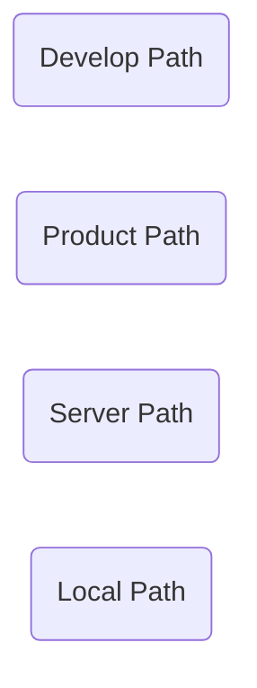
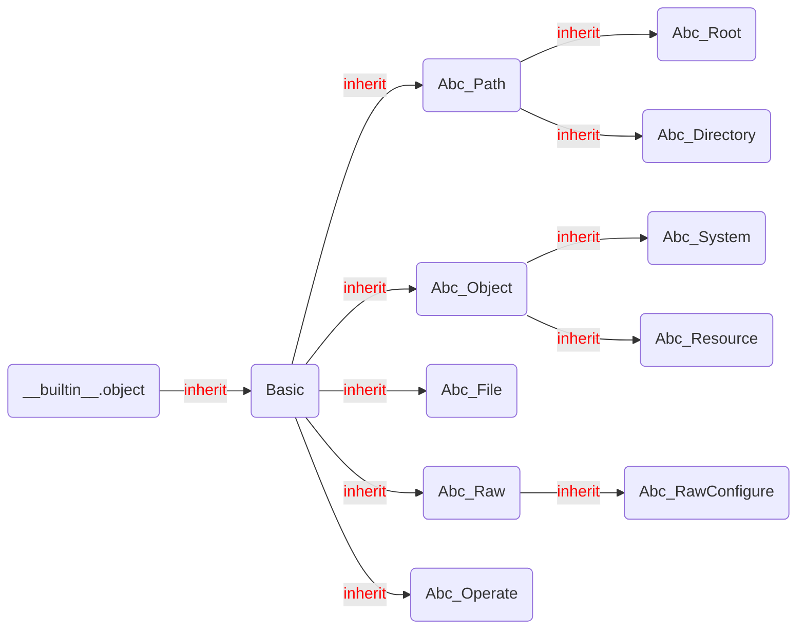
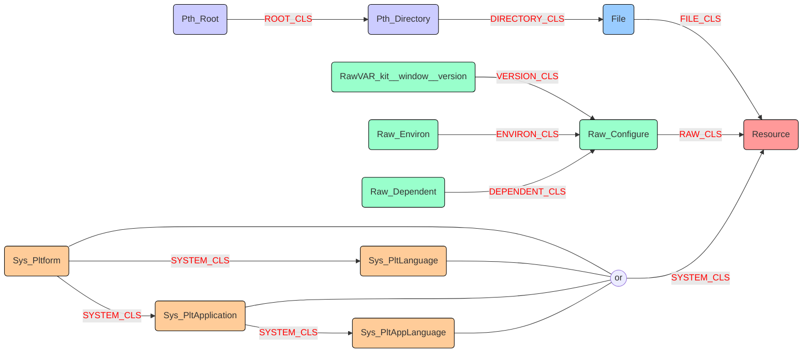
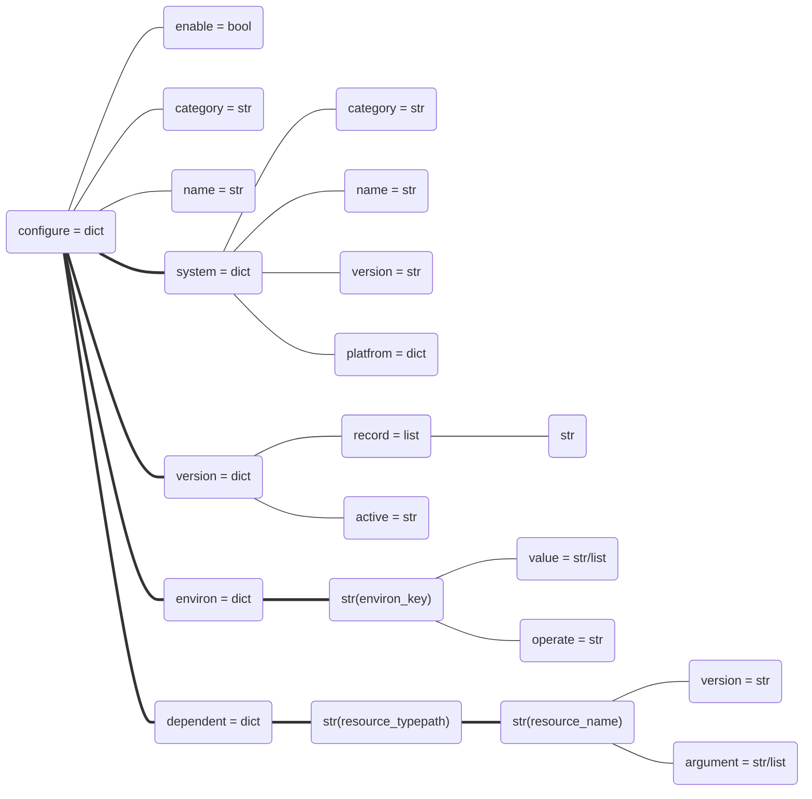

[TOC]
# Definition

### Structure



## Resource

### Abstract



### Relation



### Configure

- graph



- json

```json
{
    "enable": true, 
    "category": "plt_app_lng_module", 
    "name": "LxMaya", 
    "system": {
        "category": "plt_app_language", 
        "name": "python", 
        "version": "2.7", 
        "platform": {
            "name": "windows", 
            "version": "share"
        }, 
        "application": {
            "name": "maya", 
            "version": "share"
        }
    }, 
    "version": {
        "active": "0.0.0", 
        "record": [
            "0.0.0"
        ]
    }, 
    "environ": {
        "PATH": {
            "operate": "+", 
            "value": "{path.sourcepath}"
        }
    }, 
    "dependent": {
        "plt_lng_module": {
            "LxDatabase": {
                "version": "active", 
                "argument": [
                    "{system.platform.name}", 
                    "{system.platform.version}", 
                    "{system.name}", 
                    "{system.version}"
                ]
            }, 
            "LxDeadline": {
                "version": "active", 
                "argument": [
                    "{system.platform.name}", 
                    "{system.platform.version}", 
                    "{system.name}", 
                    "{system.version}"
                ]
            }, 
            "LxKit": {
                "version": "active", 
                "argument": [
                    "{system.platform.name}", 
                    "{system.platform.version}", 
                    "{system.name}", 
                    "{system.version}"
                ]
            }, 
            "LxGui": {
                "version": "active", 
                "argument": [
                    "{system.platform.name}", 
                    "{system.platform.version}", 
                    "{system.name}", 
                    "{system.version}"
                ]
            }, 
            "LxCore": {
                "version": "active", 
                "argument": [
                    "{system.platform.name}", 
                    "{system.platform.version}", 
                    "{system.name}", 
                    "{system.version}"
                ]
            }
        }
    }
}
```
