[TOC]

# Arnold

## Standard Surface

### Blood

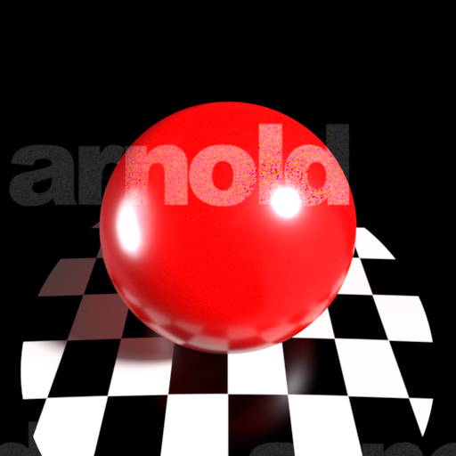

|Attribute Name|Data Type|Value|
|----|----|----|
|base|float|<u>1.0</u>|
|base_color|color3|<u>(0.4320000112056732, 0.0, 0.0)</u>|
|diffuse_roughness|float|0.0|
|specular|float|1.0|
|specular_color|color3|(1.0, 1.0, 1.0)|
|specular_roughness|float|<u>0.20000000298</u>|
|specular_IOR|float|1.5|
|specular_anisotropy|float|0.0|
|specular_rotation|float|0.0|
|metalness|float|0.0|
|transmission|float|0.0|
|transmission_color|color3|(1.0, 1.0, 1.0)|
|transmission_depth|float|0.0|
|transmission_scatter|color3|(0.0, 0.0, 0.0)|
|transmission_scatter_anisotropy|float|0.0|
|transmission_dispersion|float|0.0|
|transmission_extra_roughness|float|0.0|
|transmit_aovs|boolean|False|
|subsurface|float|<u>0.40000000596</u>|
|subsurface_color|color3|<u>(0.4320000112056732, 0.0, 0.0)</u>|
|subsurface_radius|color3|(1.0, 1.0, 1.0)|
|subsurface_scale|float|<u>0.10000000149</u>|
|subsurface_anisotropy|float|0.0|
|subsurface_type|string|randomwalk|
|sheen|float|0.0|
|sheen_color|color3|(1.0, 1.0, 1.0)|
|sheen_roughness|float|<u>0.300000011921</u>|
|thin_walled|boolean|False|
|normal|vector3|<u>(1.0, 1.0, 1.0)</u>|
|tangent|vector3|(0.0, 0.0, 0.0)|
|coat|float|0.0|
|coat_color|color3|(1.0, 1.0, 1.0)|
|coat_roughness|float|<u>0.10000000149</u>|
|coat_IOR|float|1.5|
|coat_anisotropy|float|0.0|
|coat_rotation|float|0.0|
|coat_normal|vector3|(0.0, 0.0, 0.0)|
|coat_affect_color|float|0.0|
|coat_affect_roughness|float|0.0|
|thin_film_thickness|float|0.0|
|thin_film_IOR|float|1.5|
|emission|float|0.0|
|emission_color|color3|(1.0, 1.0, 1.0)|
|opacity|color3|(1.0, 1.0, 1.0)|
|caustics|boolean|False|
|internal_reflections|boolean|True|
|exit_to_background|boolean|False|
|indirect_diffuse|float|1.0|
|indirect_specular|float|1.0|

### Brushed_Metal

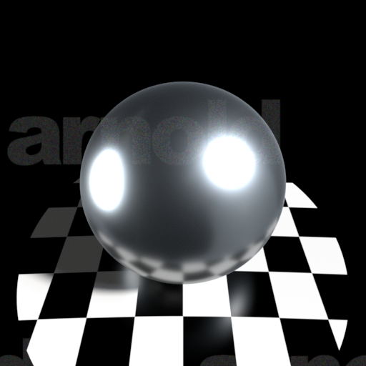

|Attribute Name|Data Type|Value|
|----|----|----|
|base|float|<u>1.0</u>|
|base_color|color3|<u>(0.5, 0.5, 0.5)</u>|
|diffuse_roughness|float|0.0|
|specular|float|<u>0.0</u>|
|specular_color|color3|<u>(0.0, 0.0, 0.0)</u>|
|specular_roughness|float|<u>0.25</u>|
|specular_IOR|float|<u>1.51999998093</u>|
|specular_anisotropy|float|0.0|
|specular_rotation|float|<u>0.5</u>|
|metalness|float|<u>1.0</u>|
|transmission|float|0.0|
|transmission_color|color3|(1.0, 1.0, 1.0)|
|transmission_depth|float|<u>1.0</u>|
|transmission_scatter|color3|(0.0, 0.0, 0.0)|
|transmission_scatter_anisotropy|float|0.0|
|transmission_dispersion|float|0.0|
|transmission_extra_roughness|float|0.0|
|transmit_aovs|boolean|False|
|subsurface|float|0.0|
|subsurface_color|color3|(1.0, 1.0, 1.0)|
|subsurface_radius|color3|(1.0, 1.0, 1.0)|
|subsurface_scale|float|1.0|
|subsurface_anisotropy|float|0.0|
|subsurface_type|string|randomwalk|
|sheen|float|0.0|
|sheen_color|color3|(1.0, 1.0, 1.0)|
|sheen_roughness|float|<u>0.300000011921</u>|
|thin_walled|boolean|False|
|normal|vector3|<u>(1.0, 1.0, 1.0)</u>|
|tangent|vector3|(0.0, 0.0, 0.0)|
|coat|float|0.0|
|coat_color|color3|<u>(0.0, 0.0, 0.0)</u>|
|coat_roughness|float|<u>0.0</u>|
|coat_IOR|float|1.5|
|coat_anisotropy|float|0.0|
|coat_rotation|float|0.0|
|coat_normal|vector3|(0.0, 0.0, 0.0)|
|coat_affect_color|float|0.0|
|coat_affect_roughness|float|0.0|
|thin_film_thickness|float|0.0|
|thin_film_IOR|float|1.5|
|emission|float|0.0|
|emission_color|color3|(1.0, 1.0, 1.0)|
|opacity|color3|(1.0, 1.0, 1.0)|
|caustics|boolean|False|
|internal_reflections|boolean|True|
|exit_to_background|boolean|False|
|indirect_diffuse|float|1.0|
|indirect_specular|float|1.0|

### Car_Paint

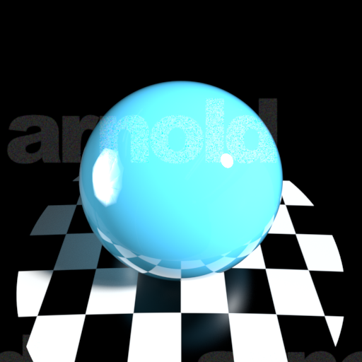

|Attribute Name|Data Type|Value|
|----|----|----|
|base|float|<u>0.5</u>|
|base_color|color3|<u>(0.10377919673919678, 0.5921202898025513, 0.850649356842041)</u>|
|diffuse_roughness|float|0.0|
|specular|float|1.0|
|specular_color|color3|(1.0, 1.0, 1.0)|
|specular_roughness|float|<u>0.0</u>|
|specular_IOR|float|<u>1.51999998093</u>|
|specular_anisotropy|float|<u>0.5</u>|
|specular_rotation|float|0.0|
|metalness|float|0.0|
|transmission|float|0.0|
|transmission_color|color3|(1.0, 1.0, 1.0)|
|transmission_depth|float|<u>1.0</u>|
|transmission_scatter|color3|(0.0, 0.0, 0.0)|
|transmission_scatter_anisotropy|float|0.0|
|transmission_dispersion|float|0.0|
|transmission_extra_roughness|float|0.0|
|transmit_aovs|boolean|False|
|subsurface|float|0.0|
|subsurface_color|color3|(1.0, 1.0, 1.0)|
|subsurface_radius|color3|(1.0, 1.0, 1.0)|
|subsurface_scale|float|1.0|
|subsurface_anisotropy|float|0.0|
|subsurface_type|string|randomwalk|
|sheen|float|0.0|
|sheen_color|color3|(1.0, 1.0, 1.0)|
|sheen_roughness|float|<u>0.300000011921</u>|
|thin_walled|boolean|False|
|normal|vector3|<u>(1.0, 1.0, 1.0)</u>|
|tangent|vector3|(0.0, 0.0, 0.0)|
|coat|float|<u>1.0</u>|
|coat_color|color3|(1.0, 1.0, 1.0)|
|coat_roughness|float|<u>0.0</u>|
|coat_IOR|float|1.5|
|coat_anisotropy|float|0.0|
|coat_rotation|float|0.0|
|coat_normal|vector3|(0.0, 0.0, 0.0)|
|coat_affect_color|float|0.0|
|coat_affect_roughness|float|0.0|
|thin_film_thickness|float|0.0|
|thin_film_IOR|float|1.5|
|emission|float|0.0|
|emission_color|color3|(1.0, 1.0, 1.0)|
|opacity|color3|(1.0, 1.0, 1.0)|
|caustics|boolean|False|
|internal_reflections|boolean|True|
|exit_to_background|boolean|False|
|indirect_diffuse|float|1.0|
|indirect_specular|float|1.0|

### Car_Paint_Metallic

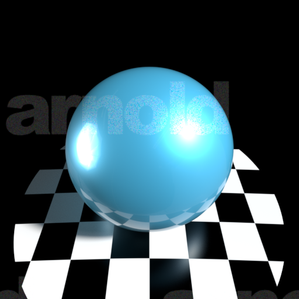

|Attribute Name|Data Type|Value|
|----|----|----|
|base|float|<u>0.800000011921</u>|
|base_color|color3|<u>(0.04357142373919487, 0.24860012531280518, 0.3571428656578064)</u>|
|diffuse_roughness|float|0.0|
|specular|float|1.0|
|specular_color|color3|<u>(0.0800129696726799, 0.4565201997756958, 0.6558441519737244)</u>|
|specular_roughness|float|<u>0.40000000596</u>|
|specular_IOR|float|1.5|
|specular_anisotropy|float|0.0|
|specular_rotation|float|0.0|
|metalness|float|<u>0.5</u>|
|transmission|float|0.0|
|transmission_color|color3|(1.0, 1.0, 1.0)|
|transmission_depth|float|<u>1.0</u>|
|transmission_scatter|color3|(0.0, 0.0, 0.0)|
|transmission_scatter_anisotropy|float|0.0|
|transmission_dispersion|float|0.0|
|transmission_extra_roughness|float|0.0|
|transmit_aovs|boolean|False|
|subsurface|float|0.0|
|subsurface_color|color3|(1.0, 1.0, 1.0)|
|subsurface_radius|color3|(1.0, 1.0, 1.0)|
|subsurface_scale|float|1.0|
|subsurface_anisotropy|float|0.0|
|subsurface_type|string|randomwalk|
|sheen|float|0.0|
|sheen_color|color3|(1.0, 1.0, 1.0)|
|sheen_roughness|float|<u>0.300000011921</u>|
|thin_walled|boolean|False|
|normal|vector3|<u>(1.0, 1.0, 1.0)</u>|
|tangent|vector3|(0.0, 0.0, 0.0)|
|coat|float|<u>1.0</u>|
|coat_color|color3|(1.0, 1.0, 1.0)|
|coat_roughness|float|<u>0.0</u>|
|coat_IOR|float|<u>1.54999995232</u>|
|coat_anisotropy|float|0.0|
|coat_rotation|float|0.0|
|coat_normal|vector3|(0.0, 0.0, 0.0)|
|coat_affect_color|float|0.0|
|coat_affect_roughness|float|0.0|
|thin_film_thickness|float|0.0|
|thin_film_IOR|float|1.5|
|emission|float|0.0|
|emission_color|color3|(1.0, 1.0, 1.0)|
|opacity|color3|(1.0, 1.0, 1.0)|
|caustics|boolean|False|
|internal_reflections|boolean|True|
|exit_to_background|boolean|False|
|indirect_diffuse|float|1.0|
|indirect_specular|float|1.0|

### Ceramic

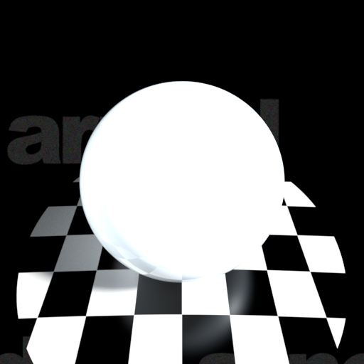

|Attribute Name|Data Type|Value|
|----|----|----|
|base|float|<u>1.0</u>|
|base_color|color3|<u>(0.800000011920929, 0.800000011920929, 0.800000011920929)</u>|
|diffuse_roughness|float|0.0|
|specular|float|1.0|
|specular_color|color3|(1.0, 1.0, 1.0)|
|specular_roughness|float|<u>0.0</u>|
|specular_IOR|float|1.5|
|specular_anisotropy|float|0.0|
|specular_rotation|float|0.0|
|metalness|float|0.0|
|transmission|float|0.0|
|transmission_color|color3|(1.0, 1.0, 1.0)|
|transmission_depth|float|0.0|
|transmission_scatter|color3|(0.0, 0.0, 0.0)|
|transmission_scatter_anisotropy|float|0.0|
|transmission_dispersion|float|0.0|
|transmission_extra_roughness|float|0.0|
|transmit_aovs|boolean|False|
|subsurface|float|<u>0.10000000149</u>|
|subsurface_color|color3|(1.0, 1.0, 1.0)|
|subsurface_radius|color3|(1.0, 1.0, 1.0)|
|subsurface_scale|float|1.0|
|subsurface_anisotropy|float|0.0|
|subsurface_type|string|randomwalk|
|sheen|float|0.0|
|sheen_color|color3|(1.0, 1.0, 1.0)|
|sheen_roughness|float|<u>0.300000011921</u>|
|thin_walled|boolean|False|
|normal|vector3|<u>(1.0, 1.0, 1.0)</u>|
|tangent|vector3|(0.0, 0.0, 0.0)|
|coat|float|0.0|
|coat_color|color3|(1.0, 1.0, 1.0)|
|coat_roughness|float|<u>0.10000000149</u>|
|coat_IOR|float|<u>1.0</u>|
|coat_anisotropy|float|0.0|
|coat_rotation|float|0.0|
|coat_normal|vector3|(0.0, 0.0, 0.0)|
|coat_affect_color|float|0.0|
|coat_affect_roughness|float|0.0|
|thin_film_thickness|float|0.0|
|thin_film_IOR|float|1.5|
|emission|float|0.0|
|emission_color|color3|(1.0, 1.0, 1.0)|
|opacity|color3|(1.0, 1.0, 1.0)|
|caustics|boolean|False|
|internal_reflections|boolean|True|
|exit_to_background|boolean|False|
|indirect_diffuse|float|1.0|
|indirect_specular|float|1.0|

### Chrome

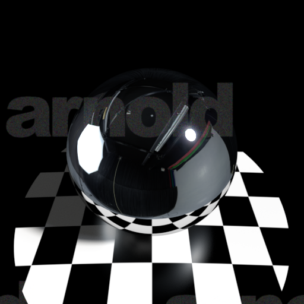

|Attribute Name|Data Type|Value|
|----|----|----|
|base|float|<u>1.0</u>|
|base_color|color3|<u>(0.7751196026802063, 0.7751196026802063, 0.7751196026802063)</u>|
|diffuse_roughness|float|0.0|
|specular|float|<u>0.0</u>|
|specular_color|color3|(1.0, 1.0, 1.0)|
|specular_roughness|float|<u>0.0</u>|
|specular_IOR|float|<u>1.51999998093</u>|
|specular_anisotropy|float|0.0|
|specular_rotation|float|0.0|
|metalness|float|<u>1.0</u>|
|transmission|float|0.0|
|transmission_color|color3|(1.0, 1.0, 1.0)|
|transmission_depth|float|0.0|
|transmission_scatter|color3|(0.0, 0.0, 0.0)|
|transmission_scatter_anisotropy|float|0.0|
|transmission_dispersion|float|0.0|
|transmission_extra_roughness|float|0.0|
|transmit_aovs|boolean|False|
|subsurface|float|0.0|
|subsurface_color|color3|(1.0, 1.0, 1.0)|
|subsurface_radius|color3|(1.0, 1.0, 1.0)|
|subsurface_scale|float|1.0|
|subsurface_anisotropy|float|0.0|
|subsurface_type|string|randomwalk|
|sheen|float|0.0|
|sheen_color|color3|(1.0, 1.0, 1.0)|
|sheen_roughness|float|<u>0.300000011921</u>|
|thin_walled|boolean|False|
|normal|vector3|<u>(1.0, 1.0, 1.0)</u>|
|tangent|vector3|(0.0, 0.0, 0.0)|
|coat|float|0.0|
|coat_color|color3|(1.0, 1.0, 1.0)|
|coat_roughness|float|<u>0.10000000149</u>|
|coat_IOR|float|<u>1.0</u>|
|coat_anisotropy|float|0.0|
|coat_rotation|float|0.0|
|coat_normal|vector3|(0.0, 0.0, 0.0)|
|coat_affect_color|float|0.0|
|coat_affect_roughness|float|0.0|
|thin_film_thickness|float|0.0|
|thin_film_IOR|float|1.5|
|emission|float|0.0|
|emission_color|color3|(1.0, 1.0, 1.0)|
|opacity|color3|(1.0, 1.0, 1.0)|
|caustics|boolean|False|
|internal_reflections|boolean|True|
|exit_to_background|boolean|False|
|indirect_diffuse|float|1.0|
|indirect_specular|float|1.0|

### Clay

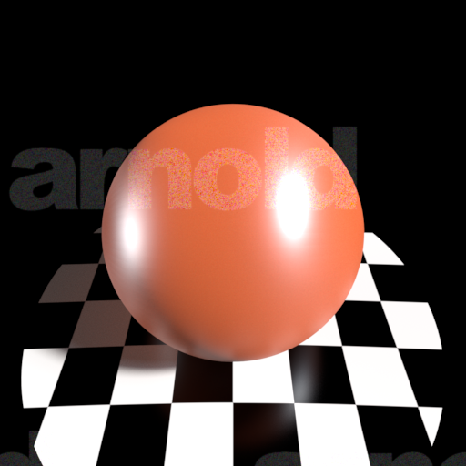

|Attribute Name|Data Type|Value|
|----|----|----|
|base|float|<u>1.0</u>|
|base_color|color3|<u>(0.30947643518447876, 0.049706704914569855, 0.013702131807804108)</u>|
|diffuse_roughness|float|<u>0.5</u>|
|specular|float|1.0|
|specular_color|color3|(1.0, 1.0, 1.0)|
|specular_roughness|float|<u>0.40000000596</u>|
|specular_IOR|float|<u>1.51999998093</u>|
|specular_anisotropy|float|<u>0.5</u>|
|specular_rotation|float|0.0|
|metalness|float|0.0|
|transmission|float|0.0|
|transmission_color|color3|(1.0, 1.0, 1.0)|
|transmission_depth|float|<u>1.0</u>|
|transmission_scatter|color3|(0.0, 0.0, 0.0)|
|transmission_scatter_anisotropy|float|0.0|
|transmission_dispersion|float|0.0|
|transmission_extra_roughness|float|0.0|
|transmit_aovs|boolean|False|
|subsurface|float|<u>0.300000011921</u>|
|subsurface_color|color3|<u>(0.30947643518447876, 0.049706704914569855, 0.013702131807804108)</u>|
|subsurface_radius|color3|<u>(0.057416267693042755, 0.009221939370036125, 0.0025421148166060448)</u>|
|subsurface_scale|float|<u>0.10000000149</u>|
|subsurface_anisotropy|float|0.0|
|subsurface_type|string|randomwalk|
|sheen|float|0.0|
|sheen_color|color3|(1.0, 1.0, 1.0)|
|sheen_roughness|float|<u>0.300000011921</u>|
|thin_walled|boolean|False|
|normal|vector3|<u>(1.0, 1.0, 1.0)</u>|
|tangent|vector3|(0.0, 0.0, 0.0)|
|coat|float|0.0|
|coat_color|color3|(1.0, 1.0, 1.0)|
|coat_roughness|float|<u>0.5</u>|
|coat_IOR|float|<u>1.0</u>|
|coat_anisotropy|float|0.0|
|coat_rotation|float|0.0|
|coat_normal|vector3|(0.0, 0.0, 0.0)|
|coat_affect_color|float|0.0|
|coat_affect_roughness|float|0.0|
|thin_film_thickness|float|0.0|
|thin_film_IOR|float|1.5|
|emission|float|0.0|
|emission_color|color3|(1.0, 1.0, 1.0)|
|opacity|color3|(1.0, 1.0, 1.0)|
|caustics|boolean|False|
|internal_reflections|boolean|True|
|exit_to_background|boolean|False|
|indirect_diffuse|float|1.0|
|indirect_specular|float|1.0|

### Copper

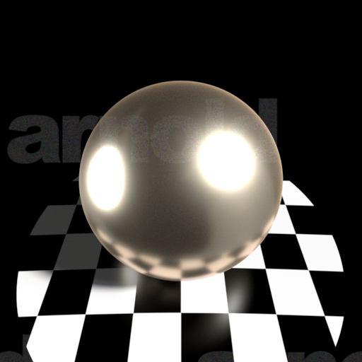

|Attribute Name|Data Type|Value|
|----|----|----|
|base|float|<u>1.0</u>|
|base_color|color3|<u>(0.9300953149795532, 0.7230695486068726, 0.5028774738311768)</u>|
|diffuse_roughness|float|0.0|
|specular|float|1.0|
|specular_color|color3|<u>(1.0000240802764893, 0.9559633731842041, 0.8227851390838623)</u>|
|specular_roughness|float|<u>0.25</u>|
|specular_IOR|float|<u>1.51999998093</u>|
|specular_anisotropy|float|0.0|
|specular_rotation|float|0.0|
|metalness|float|<u>1.0</u>|
|transmission|float|0.0|
|transmission_color|color3|(1.0, 1.0, 1.0)|
|transmission_depth|float|<u>1.0</u>|
|transmission_scatter|color3|(0.0, 0.0, 0.0)|
|transmission_scatter_anisotropy|float|0.0|
|transmission_dispersion|float|0.0|
|transmission_extra_roughness|float|0.0|
|transmit_aovs|boolean|False|
|subsurface|float|0.0|
|subsurface_color|color3|(1.0, 1.0, 1.0)|
|subsurface_radius|color3|(1.0, 1.0, 1.0)|
|subsurface_scale|float|1.0|
|subsurface_anisotropy|float|0.0|
|subsurface_type|string|randomwalk|
|sheen|float|0.0|
|sheen_color|color3|(1.0, 1.0, 1.0)|
|sheen_roughness|float|<u>0.300000011921</u>|
|thin_walled|boolean|False|
|normal|vector3|<u>(1.0, 1.0, 1.0)</u>|
|tangent|vector3|(0.0, 0.0, 0.0)|
|coat|float|0.0|
|coat_color|color3|(1.0, 1.0, 1.0)|
|coat_roughness|float|<u>0.0</u>|
|coat_IOR|float|1.5|
|coat_anisotropy|float|0.0|
|coat_rotation|float|0.0|
|coat_normal|vector3|(0.0, 0.0, 0.0)|
|coat_affect_color|float|0.0|
|coat_affect_roughness|float|0.0|
|thin_film_thickness|float|0.0|
|thin_film_IOR|float|1.5|
|emission|float|0.0|
|emission_color|color3|(1.0, 1.0, 1.0)|
|opacity|color3|(1.0, 1.0, 1.0)|
|caustics|boolean|False|
|internal_reflections|boolean|True|
|exit_to_background|boolean|False|
|indirect_diffuse|float|1.0|
|indirect_specular|float|1.0|

### Frosted_Glass

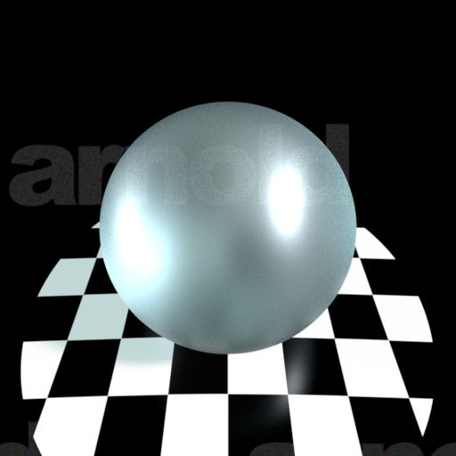

|Attribute Name|Data Type|Value|
|----|----|----|
|base|float|<u>0.0</u>|
|base_color|color3|(1.0, 1.0, 1.0)|
|diffuse_roughness|float|0.0|
|specular|float|1.0|
|specular_color|color3|(1.0, 1.0, 1.0)|
|specular_roughness|float|<u>0.40000000596</u>|
|specular_IOR|float|<u>1.51999998093</u>|
|specular_anisotropy|float|<u>0.5</u>|
|specular_rotation|float|0.0|
|metalness|float|0.0|
|transmission|float|<u>1.0</u>|
|transmission_color|color3|<u>(0.7132959961891174, 0.8180000185966492, 0.8139723539352417)</u>|
|transmission_depth|float|0.0|
|transmission_scatter|color3|<u>(0.2922077775001526, 0.2922077775001526, 0.2922077775001526)</u>|
|transmission_scatter_anisotropy|float|0.0|
|transmission_dispersion|float|0.0|
|transmission_extra_roughness|float|0.0|
|transmit_aovs|boolean|False|
|subsurface|float|0.0|
|subsurface_color|color3|(1.0, 1.0, 1.0)|
|subsurface_radius|color3|(1.0, 1.0, 1.0)|
|subsurface_scale|float|1.0|
|subsurface_anisotropy|float|0.0|
|subsurface_type|string|randomwalk|
|sheen|float|0.0|
|sheen_color|color3|(1.0, 1.0, 1.0)|
|sheen_roughness|float|<u>0.300000011921</u>|
|thin_walled|boolean|False|
|normal|vector3|<u>(1.0, 1.0, 1.0)</u>|
|tangent|vector3|(0.0, 0.0, 0.0)|
|coat|float|0.0|
|coat_color|color3|(1.0, 1.0, 1.0)|
|coat_roughness|float|<u>0.0</u>|
|coat_IOR|float|<u>1.0</u>|
|coat_anisotropy|float|0.0|
|coat_rotation|float|0.0|
|coat_normal|vector3|(0.0, 0.0, 0.0)|
|coat_affect_color|float|0.0|
|coat_affect_roughness|float|0.0|
|thin_film_thickness|float|0.0|
|thin_film_IOR|float|1.5|
|emission|float|0.0|
|emission_color|color3|(1.0, 1.0, 1.0)|
|opacity|color3|(1.0, 1.0, 1.0)|
|caustics|boolean|False|
|internal_reflections|boolean|True|
|exit_to_background|boolean|False|
|indirect_diffuse|float|1.0|
|indirect_specular|float|1.0|

### Glass

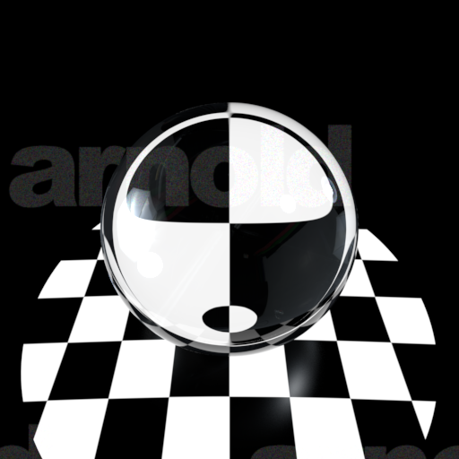

|Attribute Name|Data Type|Value|
|----|----|----|
|base|float|<u>0.0</u>|
|base_color|color3|(1.0, 1.0, 1.0)|
|diffuse_roughness|float|0.0|
|specular|float|1.0|
|specular_color|color3|(1.0, 1.0, 1.0)|
|specular_roughness|float|<u>0.0</u>|
|specular_IOR|float|<u>1.51999998093</u>|
|specular_anisotropy|float|<u>0.5</u>|
|specular_rotation|float|0.0|
|metalness|float|0.0|
|transmission|float|<u>1.0</u>|
|transmission_color|color3|(1.0, 1.0, 1.0)|
|transmission_depth|float|0.0|
|transmission_scatter|color3|(0.0, 0.0, 0.0)|
|transmission_scatter_anisotropy|float|0.0|
|transmission_dispersion|float|0.0|
|transmission_extra_roughness|float|0.0|
|transmit_aovs|boolean|False|
|subsurface|float|0.0|
|subsurface_color|color3|(1.0, 1.0, 1.0)|
|subsurface_radius|color3|(1.0, 1.0, 1.0)|
|subsurface_scale|float|1.0|
|subsurface_anisotropy|float|0.0|
|subsurface_type|string|randomwalk|
|sheen|float|0.0|
|sheen_color|color3|(1.0, 1.0, 1.0)|
|sheen_roughness|float|<u>0.300000011921</u>|
|thin_walled|boolean|False|
|normal|vector3|<u>(1.0, 1.0, 1.0)</u>|
|tangent|vector3|(0.0, 0.0, 0.0)|
|coat|float|0.0|
|coat_color|color3|(1.0, 1.0, 1.0)|
|coat_roughness|float|<u>0.0</u>|
|coat_IOR|float|<u>1.0</u>|
|coat_anisotropy|float|0.0|
|coat_rotation|float|0.0|
|coat_normal|vector3|(0.0, 0.0, 0.0)|
|coat_affect_color|float|0.0|
|coat_affect_roughness|float|0.0|
|thin_film_thickness|float|0.0|
|thin_film_IOR|float|1.5|
|emission|float|0.0|
|emission_color|color3|(1.0, 1.0, 1.0)|
|opacity|color3|(1.0, 1.0, 1.0)|
|caustics|boolean|False|
|internal_reflections|boolean|True|
|exit_to_background|boolean|False|
|indirect_diffuse|float|1.0|
|indirect_specular|float|1.0|

### Gold

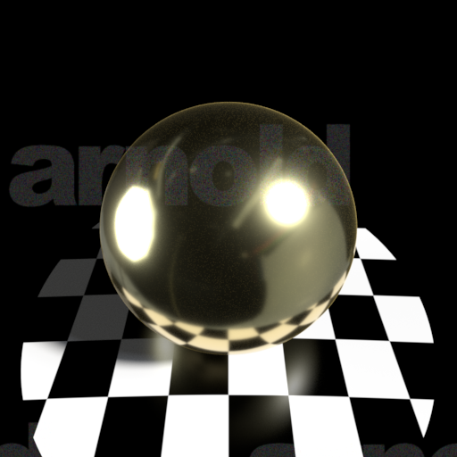

|Attribute Name|Data Type|Value|
|----|----|----|
|base|float|<u>1.0</u>|
|base_color|color3|<u>(0.9472944736480713, 0.7758305072784424, 0.37123918533325195)</u>|
|diffuse_roughness|float|0.0|
|specular|float|1.0|
|specular_color|color3|<u>(1.0000240802764893, 0.9822533130645752, 0.7529541254043579)</u>|
|specular_roughness|float|<u>0.15000000596</u>|
|specular_IOR|float|<u>1.51999998093</u>|
|specular_anisotropy|float|0.0|
|specular_rotation|float|0.0|
|metalness|float|<u>1.0</u>|
|transmission|float|0.0|
|transmission_color|color3|(1.0, 1.0, 1.0)|
|transmission_depth|float|<u>1.0</u>|
|transmission_scatter|color3|(0.0, 0.0, 0.0)|
|transmission_scatter_anisotropy|float|0.0|
|transmission_dispersion|float|0.0|
|transmission_extra_roughness|float|0.0|
|transmit_aovs|boolean|False|
|subsurface|float|0.0|
|subsurface_color|color3|(1.0, 1.0, 1.0)|
|subsurface_radius|color3|(1.0, 1.0, 1.0)|
|subsurface_scale|float|1.0|
|subsurface_anisotropy|float|0.0|
|subsurface_type|string|randomwalk|
|sheen|float|0.0|
|sheen_color|color3|(1.0, 1.0, 1.0)|
|sheen_roughness|float|<u>0.300000011921</u>|
|thin_walled|boolean|False|
|normal|vector3|<u>(1.0, 1.0, 1.0)</u>|
|tangent|vector3|(0.0, 0.0, 0.0)|
|coat|float|0.0|
|coat_color|color3|(1.0, 1.0, 1.0)|
|coat_roughness|float|<u>0.0</u>|
|coat_IOR|float|<u>4.0</u>|
|coat_anisotropy|float|0.0|
|coat_rotation|float|0.0|
|coat_normal|vector3|(0.0, 0.0, 0.0)|
|coat_affect_color|float|0.0|
|coat_affect_roughness|float|0.0|
|thin_film_thickness|float|0.0|
|thin_film_IOR|float|1.5|
|emission|float|0.0|
|emission_color|color3|(1.0, 1.0, 1.0)|
|opacity|color3|(1.0, 1.0, 1.0)|
|caustics|boolean|False|
|internal_reflections|boolean|True|
|exit_to_background|boolean|False|
|indirect_diffuse|float|1.0|
|indirect_specular|float|1.0|

### Honey

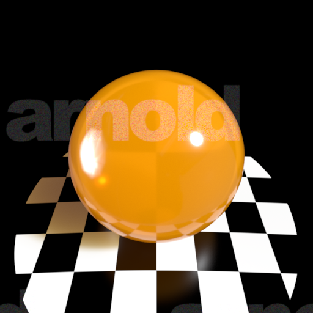

|Attribute Name|Data Type|Value|
|----|----|----|
|base|float|<u>0.0</u>|
|base_color|color3|(1.0, 1.0, 1.0)|
|diffuse_roughness|float|0.0|
|specular|float|1.0|
|specular_color|color3|(1.0, 1.0, 1.0)|
|specular_roughness|float|<u>0.10000000149</u>|
|specular_IOR|float|<u>1.51999998093</u>|
|specular_anisotropy|float|0.0|
|specular_rotation|float|0.0|
|metalness|float|0.0|
|transmission|float|<u>1.0</u>|
|transmission_color|color3|<u>(1.0, 0.5742264986038208, 0.11500000953674316)</u>|
|transmission_depth|float|<u>1.0</u>|
|transmission_scatter|color3|<u>(1.0, 0.5189000368118286, 0.0)</u>|
|transmission_scatter_anisotropy|float|0.0|
|transmission_dispersion|float|0.0|
|transmission_extra_roughness|float|0.0|
|transmit_aovs|boolean|False|
|subsurface|float|0.0|
|subsurface_color|color3|(1.0, 1.0, 1.0)|
|subsurface_radius|color3|(1.0, 1.0, 1.0)|
|subsurface_scale|float|1.0|
|subsurface_anisotropy|float|0.0|
|subsurface_type|string|randomwalk|
|sheen|float|0.0|
|sheen_color|color3|(1.0, 1.0, 1.0)|
|sheen_roughness|float|<u>0.300000011921</u>|
|thin_walled|boolean|False|
|normal|vector3|<u>(1.0, 1.0, 1.0)</u>|
|tangent|vector3|(0.0, 0.0, 0.0)|
|coat|float|0.0|
|coat_color|color3|(1.0, 1.0, 1.0)|
|coat_roughness|float|<u>0.0</u>|
|coat_IOR|float|1.5|
|coat_anisotropy|float|0.0|
|coat_rotation|float|0.0|
|coat_normal|vector3|(0.0, 0.0, 0.0)|
|coat_affect_color|float|0.0|
|coat_affect_roughness|float|0.0|
|thin_film_thickness|float|0.0|
|thin_film_IOR|float|1.5|
|emission|float|0.0|
|emission_color|color3|(1.0, 1.0, 1.0)|
|opacity|color3|(1.0, 1.0, 1.0)|
|caustics|boolean|False|
|internal_reflections|boolean|True|
|exit_to_background|boolean|False|
|indirect_diffuse|float|1.0|
|indirect_specular|float|1.0|

### Incandescent_Bulb

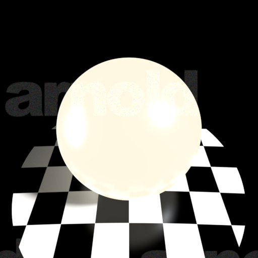

|Attribute Name|Data Type|Value|
|----|----|----|
|base|float|<u>0.0</u>|
|base_color|color3|(1.0, 1.0, 1.0)|
|diffuse_roughness|float|0.0|
|specular|float|1.0|
|specular_color|color3|(1.0, 1.0, 1.0)|
|specular_roughness|float|<u>0.20000000298</u>|
|specular_IOR|float|1.5|
|specular_anisotropy|float|0.0|
|specular_rotation|float|0.0|
|metalness|float|0.0|
|transmission|float|0.0|
|transmission_color|color3|(1.0, 1.0, 1.0)|
|transmission_depth|float|0.0|
|transmission_scatter|color3|(0.0, 0.0, 0.0)|
|transmission_scatter_anisotropy|float|0.0|
|transmission_dispersion|float|0.0|
|transmission_extra_roughness|float|0.0|
|transmit_aovs|boolean|False|
|subsurface|float|0.0|
|subsurface_color|color3|(1.0, 1.0, 1.0)|
|subsurface_radius|color3|(1.0, 1.0, 1.0)|
|subsurface_scale|float|1.0|
|subsurface_anisotropy|float|0.0|
|subsurface_type|string|randomwalk|
|sheen|float|0.0|
|sheen_color|color3|(1.0, 1.0, 1.0)|
|sheen_roughness|float|<u>0.300000011921</u>|
|thin_walled|boolean|False|
|normal|vector3|<u>(1.0, 1.0, 1.0)</u>|
|tangent|vector3|(0.0, 0.0, 0.0)|
|coat|float|0.0|
|coat_color|color3|(1.0, 1.0, 1.0)|
|coat_roughness|float|<u>0.10000000149</u>|
|coat_IOR|float|1.5|
|coat_anisotropy|float|0.0|
|coat_rotation|float|0.0|
|coat_normal|vector3|(0.0, 0.0, 0.0)|
|coat_affect_color|float|0.0|
|coat_affect_roughness|float|0.0|
|thin_film_thickness|float|0.0|
|thin_film_IOR|float|1.5|
|emission|float|<u>1.0</u>|
|emission_color|color3|<u>(0.9935064911842346, 0.9320982098579407, 0.7597633600234985)</u>|
|opacity|color3|(1.0, 1.0, 1.0)|
|caustics|boolean|False|
|internal_reflections|boolean|True|
|exit_to_background|boolean|False|
|indirect_diffuse|float|1.0|
|indirect_specular|float|1.0|

### Jade

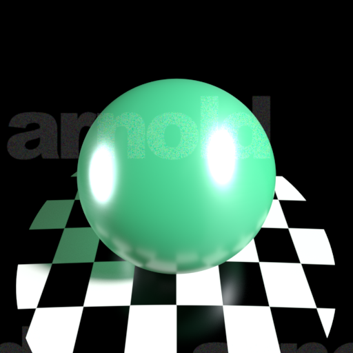

|Attribute Name|Data Type|Value|
|----|----|----|
|base|float|<u>1.0</u>|
|base_color|color3|<u>(0.06030000001192093, 0.4397999942302704, 0.1915999948978424)</u>|
|diffuse_roughness|float|0.0|
|specular|float|1.0|
|specular_color|color3|(1.0, 1.0, 1.0)|
|specular_roughness|float|<u>0.25</u>|
|specular_IOR|float|<u>2.41799998283</u>|
|specular_anisotropy|float|<u>0.5</u>|
|specular_rotation|float|0.0|
|metalness|float|0.0|
|transmission|float|<u>0.600000023842</u>|
|transmission_color|color3|<u>(0.06030000001192093, 0.4397999942302704, 0.1915999948978424)</u>|
|transmission_depth|float|0.0|
|transmission_scatter|color3|<u>(1.0, 1.0, 1.0)</u>|
|transmission_scatter_anisotropy|float|0.0|
|transmission_dispersion|float|0.0|
|transmission_extra_roughness|float|0.0|
|transmit_aovs|boolean|False|
|subsurface|float|0.0|
|subsurface_color|color3|<u>(0.06030000001192093, 0.4397999942302704, 0.1915999948978424)</u>|
|subsurface_radius|color3|(1.0, 1.0, 1.0)|
|subsurface_scale|float|<u>0.10000000149</u>|
|subsurface_anisotropy|float|0.0|
|subsurface_type|string|randomwalk|
|sheen|float|0.0|
|sheen_color|color3|(1.0, 1.0, 1.0)|
|sheen_roughness|float|<u>0.300000011921</u>|
|thin_walled|boolean|False|
|normal|vector3|<u>(1.0, 1.0, 1.0)</u>|
|tangent|vector3|(0.0, 0.0, 0.0)|
|coat|float|0.0|
|coat_color|color3|(1.0, 1.0, 1.0)|
|coat_roughness|float|<u>0.0</u>|
|coat_IOR|float|<u>1.0</u>|
|coat_anisotropy|float|0.0|
|coat_rotation|float|0.0|
|coat_normal|vector3|(0.0, 0.0, 0.0)|
|coat_affect_color|float|0.0|
|coat_affect_roughness|float|0.0|
|thin_film_thickness|float|0.0|
|thin_film_IOR|float|1.5|
|emission|float|0.0|
|emission_color|color3|(1.0, 1.0, 1.0)|
|opacity|color3|(1.0, 1.0, 1.0)|
|caustics|boolean|False|
|internal_reflections|boolean|True|
|exit_to_background|boolean|False|
|indirect_diffuse|float|1.0|
|indirect_specular|float|1.0|

### Milk

|Attribute Name|Data Type|Value|
|----|----|----|
|base|float|<u>1.0</u>|
|base_color|color3|(1.0, 1.0, 1.0)|
|diffuse_roughness|float|0.0|
|specular|float|1.0|
|specular_color|color3|(1.0, 1.0, 1.0)|
|specular_roughness|float|<u>0.15000000596</u>|
|specular_IOR|float|<u>1.51999998093</u>|
|specular_anisotropy|float|0.0|
|specular_rotation|float|0.0|
|metalness|float|0.0|
|transmission|float|0.0|
|transmission_color|color3|(1.0, 1.0, 1.0)|
|transmission_depth|float|<u>1.0</u>|
|transmission_scatter|color3|<u>(1.0, 1.0, 1.0)</u>|
|transmission_scatter_anisotropy|float|0.0|
|transmission_dispersion|float|0.0|
|transmission_extra_roughness|float|0.0|
|transmit_aovs|boolean|False|
|subsurface|float|<u>1.0</u>|
|subsurface_color|color3|(1.0, 1.0, 1.0)|
|subsurface_radius|color3|(1.0, 1.0, 1.0)|
|subsurface_scale|float|<u>0.10000000149</u>|
|subsurface_anisotropy|float|0.0|
|subsurface_type|string|<u>randomwalk_v2</u>|
|sheen|float|0.0|
|sheen_color|color3|(1.0, 1.0, 1.0)|
|sheen_roughness|float|<u>0.300000011921</u>|
|thin_walled|boolean|False|
|normal|vector3|<u>(1.0, 1.0, 1.0)</u>|
|tangent|vector3|(0.0, 0.0, 0.0)|
|coat|float|0.0|
|coat_color|color3|(1.0, 1.0, 1.0)|
|coat_roughness|float|<u>0.0</u>|
|coat_IOR|float|1.5|
|coat_anisotropy|float|0.0|
|coat_rotation|float|0.0|
|coat_normal|vector3|(0.0, 0.0, 0.0)|
|coat_affect_color|float|0.0|
|coat_affect_roughness|float|0.0|
|thin_film_thickness|float|0.0|
|thin_film_IOR|float|1.5|
|emission|float|0.0|
|emission_color|color3|(1.0, 1.0, 1.0)|
|opacity|color3|(1.0, 1.0, 1.0)|
|caustics|boolean|False|
|internal_reflections|boolean|True|
|exit_to_background|boolean|False|
|indirect_diffuse|float|1.0|
|indirect_specular|float|1.0|

### Orange_Juice

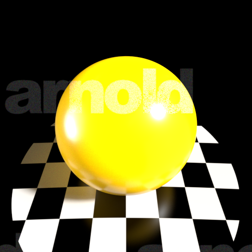

|Attribute Name|Data Type|Value|
|----|----|----|
|base|float|<u>1.0</u>|
|base_color|color3|<u>(0.8309999704360962, 0.4262999892234802, 0.0)</u>|
|diffuse_roughness|float|0.0|
|specular|float|1.0|
|specular_color|color3|(1.0, 1.0, 1.0)|
|specular_roughness|float|<u>0.20000000298</u>|
|specular_IOR|float|<u>1.39999997616</u>|
|specular_anisotropy|float|0.0|
|specular_rotation|float|0.0|
|metalness|float|0.0|
|transmission|float|0.0|
|transmission_color|color3|(1.0, 1.0, 1.0)|
|transmission_depth|float|0.0|
|transmission_scatter|color3|(0.0, 0.0, 0.0)|
|transmission_scatter_anisotropy|float|0.0|
|transmission_dispersion|float|0.0|
|transmission_extra_roughness|float|0.0|
|transmit_aovs|boolean|False|
|subsurface|float|<u>1.0</u>|
|subsurface_color|color3|<u>(0.8309999704360962, 0.4262999892234802, 0.0)</u>|
|subsurface_radius|color3|<u>(0.110047847032547, 0.05645415186882019, 0.0)</u>|
|subsurface_scale|float|<u>0.10000000149</u>|
|subsurface_anisotropy|float|0.0|
|subsurface_type|string|randomwalk|
|sheen|float|0.0|
|sheen_color|color3|(1.0, 1.0, 1.0)|
|sheen_roughness|float|<u>0.300000011921</u>|
|thin_walled|boolean|False|
|normal|vector3|<u>(1.0, 1.0, 1.0)</u>|
|tangent|vector3|(0.0, 0.0, 0.0)|
|coat|float|0.0|
|coat_color|color3|(1.0, 1.0, 1.0)|
|coat_roughness|float|<u>0.0</u>|
|coat_IOR|float|1.5|
|coat_anisotropy|float|0.0|
|coat_rotation|float|0.0|
|coat_normal|vector3|(0.0, 0.0, 0.0)|
|coat_affect_color|float|0.0|
|coat_affect_roughness|float|0.0|
|thin_film_thickness|float|0.0|
|thin_film_IOR|float|1.5|
|emission|float|0.0|
|emission_color|color3|(1.0, 1.0, 1.0)|
|opacity|color3|(1.0, 1.0, 1.0)|
|caustics|boolean|False|
|internal_reflections|boolean|True|
|exit_to_background|boolean|False|
|indirect_diffuse|float|1.0|
|indirect_specular|float|1.0|

### Plastic

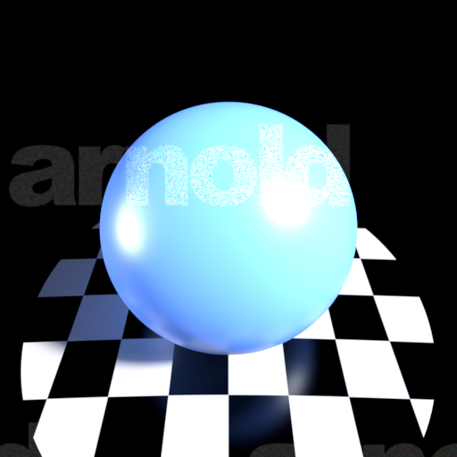

|Attribute Name|Data Type|Value|
|----|----|----|
|base|float|<u>1.0</u>|
|base_color|color3|<u>(0.10470402240753174, 0.2418828159570694, 0.8180000185966492)</u>|
|diffuse_roughness|float|0.0|
|specular|float|1.0|
|specular_color|color3|(1.0, 1.0, 1.0)|
|specular_roughness|float|<u>0.324675321579</u>|
|specular_IOR|float|1.5|
|specular_anisotropy|float|0.0|
|specular_rotation|float|0.0|
|metalness|float|0.0|
|transmission|float|0.0|
|transmission_color|color3|(1.0, 1.0, 1.0)|
|transmission_depth|float|0.0|
|transmission_scatter|color3|(0.0, 0.0, 0.0)|
|transmission_scatter_anisotropy|float|0.0|
|transmission_dispersion|float|0.0|
|transmission_extra_roughness|float|0.0|
|transmit_aovs|boolean|False|
|subsurface|float|0.0|
|subsurface_color|color3|(1.0, 1.0, 1.0)|
|subsurface_radius|color3|(1.0, 1.0, 1.0)|
|subsurface_scale|float|1.0|
|subsurface_anisotropy|float|0.0|
|subsurface_type|string|randomwalk|
|sheen|float|0.0|
|sheen_color|color3|(1.0, 1.0, 1.0)|
|sheen_roughness|float|<u>0.300000011921</u>|
|thin_walled|boolean|False|
|normal|vector3|<u>(1.0, 1.0, 1.0)</u>|
|tangent|vector3|(0.0, 0.0, 0.0)|
|coat|float|0.0|
|coat_color|color3|(1.0, 1.0, 1.0)|
|coat_roughness|float|<u>0.0</u>|
|coat_IOR|float|1.5|
|coat_anisotropy|float|0.0|
|coat_rotation|float|0.0|
|coat_normal|vector3|(0.0, 0.0, 0.0)|
|coat_affect_color|float|0.0|
|coat_affect_roughness|float|0.0|
|thin_film_thickness|float|0.0|
|thin_film_IOR|float|1.5|
|emission|float|0.0|
|emission_color|color3|(1.0, 1.0, 1.0)|
|opacity|color3|(1.0, 1.0, 1.0)|
|caustics|boolean|False|
|internal_reflections|boolean|True|
|exit_to_background|boolean|False|
|indirect_diffuse|float|1.0|
|indirect_specular|float|1.0|

### Rubber

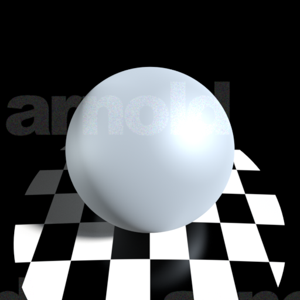

|Attribute Name|Data Type|Value|
|----|----|----|
|base|float|<u>1.0</u>|
|base_color|color3|<u>(0.22891566157341003, 0.22891566157341003, 0.22891566157341003)</u>|
|diffuse_roughness|float|<u>1.0</u>|
|specular|float|1.0|
|specular_color|color3|(1.0, 1.0, 1.0)|
|specular_roughness|float|<u>0.600000023842</u>|
|specular_IOR|float|1.5|
|specular_anisotropy|float|0.0|
|specular_rotation|float|0.0|
|metalness|float|0.0|
|transmission|float|0.0|
|transmission_color|color3|(1.0, 1.0, 1.0)|
|transmission_depth|float|0.0|
|transmission_scatter|color3|(0.0, 0.0, 0.0)|
|transmission_scatter_anisotropy|float|0.0|
|transmission_dispersion|float|0.0|
|transmission_extra_roughness|float|0.0|
|transmit_aovs|boolean|False|
|subsurface|float|0.0|
|subsurface_color|color3|(1.0, 1.0, 1.0)|
|subsurface_radius|color3|(1.0, 1.0, 1.0)|
|subsurface_scale|float|1.0|
|subsurface_anisotropy|float|0.0|
|subsurface_type|string|randomwalk|
|sheen|float|0.0|
|sheen_color|color3|(1.0, 1.0, 1.0)|
|sheen_roughness|float|<u>0.300000011921</u>|
|thin_walled|boolean|False|
|normal|vector3|<u>(1.0, 1.0, 1.0)</u>|
|tangent|vector3|(0.0, 0.0, 0.0)|
|coat|float|0.0|
|coat_color|color3|(1.0, 1.0, 1.0)|
|coat_roughness|float|<u>0.10000000149</u>|
|coat_IOR|float|1.5|
|coat_anisotropy|float|0.0|
|coat_rotation|float|0.0|
|coat_normal|vector3|(0.0, 0.0, 0.0)|
|coat_affect_color|float|0.0|
|coat_affect_roughness|float|0.0|
|thin_film_thickness|float|0.0|
|thin_film_IOR|float|1.5|
|emission|float|0.0|
|emission_color|color3|(1.0, 1.0, 1.0)|
|opacity|color3|(1.0, 1.0, 1.0)|
|caustics|boolean|False|
|internal_reflections|boolean|True|
|exit_to_background|boolean|False|
|indirect_diffuse|float|1.0|
|indirect_specular|float|1.0|

### Thin_Plastic

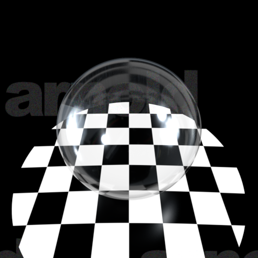

|Attribute Name|Data Type|Value|
|----|----|----|
|base|float|<u>0.0</u>|
|base_color|color3|(1.0, 1.0, 1.0)|
|diffuse_roughness|float|0.0|
|specular|float|1.0|
|specular_color|color3|(1.0, 1.0, 1.0)|
|specular_roughness|float|<u>0.10000000149</u>|
|specular_IOR|float|<u>1.51999998093</u>|
|specular_anisotropy|float|<u>0.5</u>|
|specular_rotation|float|0.0|
|metalness|float|0.0|
|transmission|float|<u>1.0</u>|
|transmission_color|color3|(1.0, 1.0, 1.0)|
|transmission_depth|float|0.0|
|transmission_scatter|color3|<u>(1.0, 1.0, 1.0)</u>|
|transmission_scatter_anisotropy|float|0.0|
|transmission_dispersion|float|0.0|
|transmission_extra_roughness|float|0.0|
|transmit_aovs|boolean|False|
|subsurface|float|0.0|
|subsurface_color|color3|(1.0, 1.0, 1.0)|
|subsurface_radius|color3|(1.0, 1.0, 1.0)|
|subsurface_scale|float|1.0|
|subsurface_anisotropy|float|0.0|
|subsurface_type|string|randomwalk|
|sheen|float|0.0|
|sheen_color|color3|(1.0, 1.0, 1.0)|
|sheen_roughness|float|<u>0.300000011921</u>|
|thin_walled|boolean|<u>True</u>|
|normal|vector3|<u>(1.0, 1.0, 1.0)</u>|
|tangent|vector3|(0.0, 0.0, 0.0)|
|coat|float|0.0|
|coat_color|color3|(1.0, 1.0, 1.0)|
|coat_roughness|float|<u>0.0</u>|
|coat_IOR|float|<u>1.0</u>|
|coat_anisotropy|float|0.0|
|coat_rotation|float|0.0|
|coat_normal|vector3|(0.0, 0.0, 0.0)|
|coat_affect_color|float|0.0|
|coat_affect_roughness|float|0.0|
|thin_film_thickness|float|0.0|
|thin_film_IOR|float|1.5|
|emission|float|0.0|
|emission_color|color3|(1.0, 1.0, 1.0)|
|opacity|color3|(1.0, 1.0, 1.0)|
|caustics|boolean|False|
|internal_reflections|boolean|True|
|exit_to_background|boolean|False|
|indirect_diffuse|float|1.0|
|indirect_specular|float|1.0|

### Two_Tone_Car_Paint2

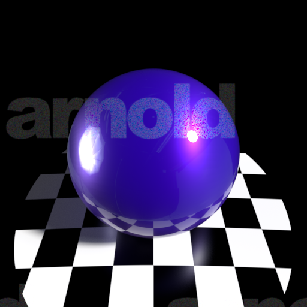

|Attribute Name|Data Type|Value|
|----|----|----|
|base|float|<u>0.800000011921</u>|
|base_color|color3|<u>(0.011500000022351742, 0.0, 0.15700000524520874)</u>|
|diffuse_roughness|float|0.0|
|specular|float|1.0|
|specular_color|color3|<u>(0.5, 0.0, 1.0)</u>|
|specular_roughness|float|<u>0.402597397566</u>|
|specular_IOR|float|<u>1.54999995232</u>|
|specular_anisotropy|float|<u>0.5</u>|
|specular_rotation|float|0.0|
|metalness|float|<u>0.370129883289</u>|
|transmission|float|0.0|
|transmission_color|color3|(1.0, 1.0, 1.0)|
|transmission_depth|float|<u>1.0</u>|
|transmission_scatter|color3|(0.0, 0.0, 0.0)|
|transmission_scatter_anisotropy|float|0.0|
|transmission_dispersion|float|0.0|
|transmission_extra_roughness|float|0.0|
|transmit_aovs|boolean|False|
|subsurface|float|0.0|
|subsurface_color|color3|(1.0, 1.0, 1.0)|
|subsurface_radius|color3|(1.0, 1.0, 1.0)|
|subsurface_scale|float|1.0|
|subsurface_anisotropy|float|0.0|
|subsurface_type|string|randomwalk|
|sheen|float|0.0|
|sheen_color|color3|(1.0, 1.0, 1.0)|
|sheen_roughness|float|<u>0.300000011921</u>|
|thin_walled|boolean|False|
|normal|vector3|<u>(0.0, 0.0, 1.0)</u>|
|tangent|vector3|(0.0, 0.0, 0.0)|
|coat|float|<u>1.0</u>|
|coat_color|color3|(1.0, 1.0, 1.0)|
|coat_roughness|float|<u>0.0</u>|
|coat_IOR|float|<u>1.54999995232</u>|
|coat_anisotropy|float|0.0|
|coat_rotation|float|0.0|
|coat_normal|vector3|(0.0, 0.0, 0.0)|
|coat_affect_color|float|0.0|
|coat_affect_roughness|float|0.0|
|thin_film_thickness|float|0.0|
|thin_film_IOR|float|1.5|
|emission|float|0.0|
|emission_color|color3|(1.0, 1.0, 1.0)|
|opacity|color3|(1.0, 1.0, 1.0)|
|caustics|boolean|False|
|internal_reflections|boolean|True|
|exit_to_background|boolean|False|
|indirect_diffuse|float|1.0|
|indirect_specular|float|1.0|

### Velvet

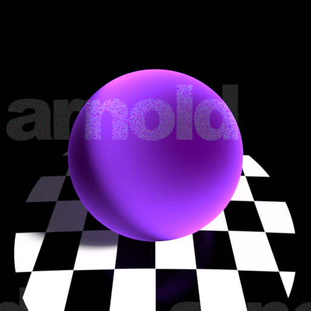

|Attribute Name|Data Type|Value|
|----|----|----|
|base|float|<u>0.800000011921</u>|
|base_color|color3|<u>(0.029130585491657257, 0.0, 0.047337278723716736)</u>|
|diffuse_roughness|float|0.0|
|specular|float|<u>0.0</u>|
|specular_color|color3|<u>(0.0, 0.0, 0.0)</u>|
|specular_roughness|float|<u>0.692771077156</u>|
|specular_IOR|float|<u>0.0</u>|
|specular_anisotropy|float|<u>0.188311681151</u>|
|specular_rotation|float|0.0|
|metalness|float|0.0|
|transmission|float|0.0|
|transmission_color|color3|(1.0, 1.0, 1.0)|
|transmission_depth|float|0.0|
|transmission_scatter|color3|(0.0, 0.0, 0.0)|
|transmission_scatter_anisotropy|float|0.0|
|transmission_dispersion|float|0.0|
|transmission_extra_roughness|float|0.0|
|transmit_aovs|boolean|False|
|subsurface|float|0.0|
|subsurface_color|color3|(1.0, 1.0, 1.0)|
|subsurface_radius|color3|(1.0, 1.0, 1.0)|
|subsurface_scale|float|1.0|
|subsurface_anisotropy|float|0.0|
|subsurface_type|string|<u>diffusion</u>|
|sheen|float|<u>1.0</u>|
|sheen_color|color3|<u>(0.40380001068115234, 0.057999998331069946, 1.0)</u>|
|sheen_roughness|float|<u>0.300000011921</u>|
|thin_walled|boolean|False|
|normal|vector3|<u>(1.0, 1.0, 1.0)</u>|
|tangent|vector3|(0.0, 0.0, 0.0)|
|coat|float|0.0|
|coat_color|color3|<u>(0.0, 0.0, 0.0)</u>|
|coat_roughness|float|<u>0.791666686535</u>|
|coat_IOR|float|<u>0.0</u>|
|coat_anisotropy|float|0.0|
|coat_rotation|float|0.0|
|coat_normal|vector3|<u>(0.0, 0.0, 1.0)</u>|
|coat_affect_color|float|0.0|
|coat_affect_roughness|float|0.0|
|thin_film_thickness|float|0.0|
|thin_film_IOR|float|1.5|
|emission|float|0.0|
|emission_color|color3|(1.0, 1.0, 1.0)|
|opacity|color3|(1.0, 1.0, 1.0)|
|caustics|boolean|False|
|internal_reflections|boolean|True|
|exit_to_background|boolean|False|
|indirect_diffuse|float|1.0|
|indirect_specular|float|1.0|

### Wax

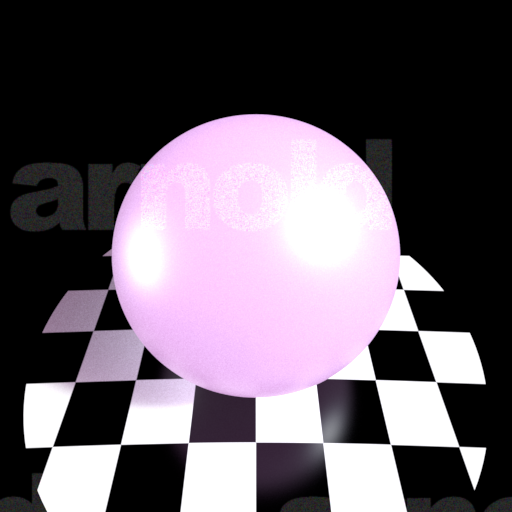

|Attribute Name|Data Type|Value|
|----|----|----|
|base|float|<u>1.0</u>|
|base_color|color3|<u>(1.0, 0.48100000619888306, 0.8637536764144897)</u>|
|diffuse_roughness|float|0.0|
|specular|float|1.0|
|specular_color|color3|(1.0, 1.0, 1.0)|
|specular_roughness|float|<u>0.40000000596</u>|
|specular_IOR|float|<u>1.51999998093</u>|
|specular_anisotropy|float|0.0|
|specular_rotation|float|0.0|
|metalness|float|0.0|
|transmission|float|<u>0.800000011921</u>|
|transmission_color|color3|<u>(1.0, 0.48100000619888306, 0.8637536764144897)</u>|
|transmission_depth|float|<u>1.0</u>|
|transmission_scatter|color3|<u>(1.0, 0.48100000619888306, 0.8637536764144897)</u>|
|transmission_scatter_anisotropy|float|0.0|
|transmission_dispersion|float|0.0|
|transmission_extra_roughness|float|0.0|
|transmit_aovs|boolean|False|
|subsurface|float|<u>1.0</u>|
|subsurface_color|color3|<u>(1.0, 0.48100000619888306, 0.8637536764144897)</u>|
|subsurface_radius|color3|(1.0, 1.0, 1.0)|
|subsurface_scale|float|1.0|
|subsurface_anisotropy|float|0.0|
|subsurface_type|string|<u>randomwalk_v2</u>|
|sheen|float|0.0|
|sheen_color|color3|(1.0, 1.0, 1.0)|
|sheen_roughness|float|<u>0.300000011921</u>|
|thin_walled|boolean|False|
|normal|vector3|<u>(1.0, 1.0, 1.0)</u>|
|tangent|vector3|(0.0, 0.0, 0.0)|
|coat|float|0.0|
|coat_color|color3|(1.0, 1.0, 1.0)|
|coat_roughness|float|<u>0.10000000149</u>|
|coat_IOR|float|1.5|
|coat_anisotropy|float|0.0|
|coat_rotation|float|0.0|
|coat_normal|vector3|(0.0, 0.0, 0.0)|
|coat_affect_color|float|0.0|
|coat_affect_roughness|float|0.0|
|thin_film_thickness|float|0.0|
|thin_film_IOR|float|1.5|
|emission|float|0.0|
|emission_color|color3|(1.0, 1.0, 1.0)|
|opacity|color3|(1.0, 1.0, 1.0)|
|caustics|boolean|False|
|internal_reflections|boolean|True|
|exit_to_background|boolean|False|
|indirect_diffuse|float|1.0|
|indirect_specular|float|1.0|
