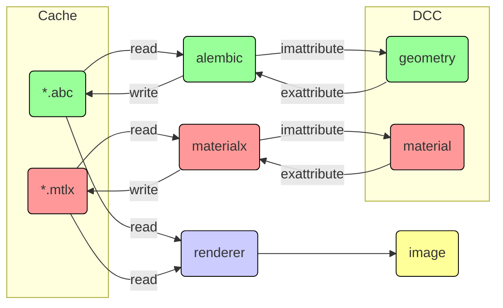
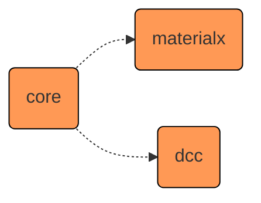
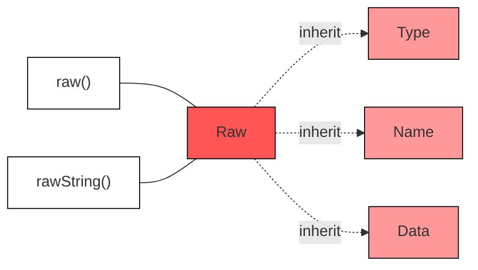
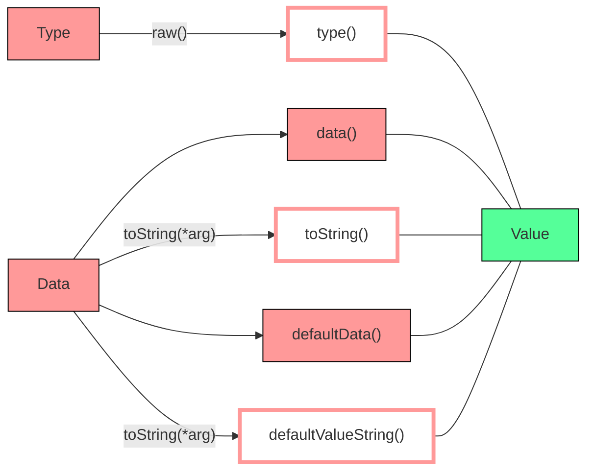
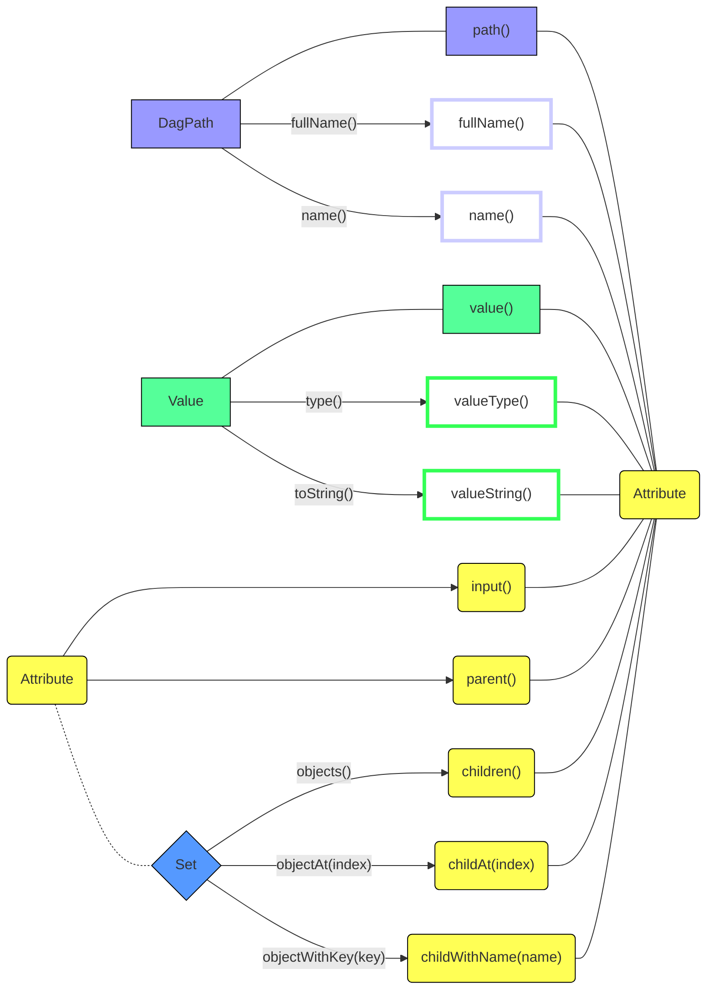
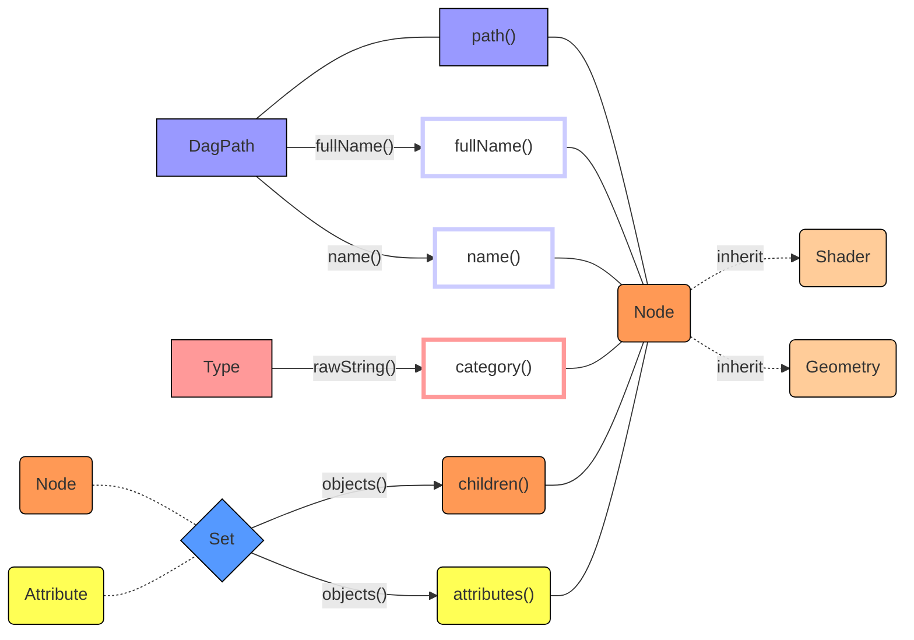

[TOC]

# Render Flow



# Develop

## Module



### Core

##### Asset

##### Raw



##### Set

```mermaid
graph LR
    classDef pink_0 fill:#f9c,stroke:#000,stroke-width:1px,fill-opacity:1
    classDef pink_1 fill:#f59,stroke:#000,stroke-width:1px,fill-opacity:1
    classDef red_0 fill:#f99,stroke:#000,stroke-width:1px,fill-opacity:1
    classDef red_1 fill:#f55,stroke:#000,stroke-width:1px,fill-opacity:1
    classDef orange_0 fill:#fc9,stroke:#000,stroke-width:1px,fill-opacity:1
    classDef orange_1 fill:#f95,stroke:#000,stroke-width:1px,fill-opacity:1
    classDef violet_0 fill:#ccf,stroke:#000,stroke-width:1px,fill-opacity:1
    classDef violet_1 fill:#99f,stroke:#000,stroke-width:1px,fill-opacity:1
    classDef yellow_0 fill:#ff9,stroke:#000,stroke-width:1px,fill-opacity:1
    classDef yellow_1 fill:#ff5,stroke:#000,stroke-width:1px,fill-opacity:1
    classDef blue_0 fill:#9cf,stroke:#000,stroke-width:1px,fill-opacity:1
    classDef blue_1 fill:#59f,stroke:#000,stroke-width:1px,fill-opacity:1
    classDef green_0 fill:#9fc,stroke:#000,stroke-width:1px,fill-opacity:1
    classDef green_1 fill:#5f9,stroke:#000,stroke-width:1px,fill-opacity:1
    classDef white_0 fill:#fff,stroke:#000,stroke-width:1px,fill-opacity:1
    
    classDef white_red_0 fill:#fff,stroke:#f99,stroke-width:4px,fill-opacity:1
    classDef white_red_1 fill:#fff,stroke:#f55,stroke-width:4px,fill-opacity:1
    classDef white_orange_0 fill:#fff,stroke:#fc9,stroke-width:4px,fill-opacity:1
    classDef white_orange_1 fill:#fff,stroke:#f95,stroke-width:4px,fill-opacity:1
    classDef white_yellow_0 fill:#fff,stroke:#ff9,stroke-width:4px,fill-opacity:1
    classDef white_yellow_1 fill:#fff,stroke:#ff5,stroke-width:4px,fill-opacity:1
    classDef white_green_0 fill:#fff,stroke:#9fc,stroke-width:4px,fill-opacity:1
    classDef white_green_1 fill:#fff,stroke:#3f5,stroke-width:4px,fill-opacity:1
    classDef white_blue_0 fill:#fff,stroke:#9cf,stroke-width:4px,fill-opacity:1
    classDef white_blue_1 fill:#fff,stroke:#59f,stroke-width:4px,fill-opacity:1
    classDef white_violet_0 fill:#fff,stroke:#ccf,stroke-width:4px,fill-opacity:1
    classDef white_violet_1 fill:#fff,stroke:#99f,stroke-width:4px,fill-opacity:1

core_set("ObjectSet"); class core_set blue_1

set_shader("ShaderSet"); class set_shader blue_0
core_set -.->|"inherit"| set_shader

set_Attribute("AttributeSet"); class set_Attribute blue_0
core_set -.->|"inherit"| set_Attribute
```



##### Value



##### Attribute



##### Node



##### Assign

```mermaid

```

#### Work Flow

```mermaid
graph TB
    classDef pink_0 fill:#f9c,stroke:#000,stroke-width:1px,fill-opacity:1
    classDef pink_1 fill:#f59,stroke:#000,stroke-width:1px,fill-opacity:1
    classDef red_0 fill:#f99,stroke:#000,stroke-width:1px,fill-opacity:1
    classDef red_1 fill:#f55,stroke:#000,stroke-width:1px,fill-opacity:1
    classDef orange_0 fill:#fc9,stroke:#000,stroke-width:1px,fill-opacity:1
    classDef orange_1 fill:#f95,stroke:#000,stroke-width:1px,fill-opacity:1
    classDef violet_0 fill:#ccf,stroke:#000,stroke-width:1px,fill-opacity:1
    classDef violet_1 fill:#99f,stroke:#000,stroke-width:1px,fill-opacity:1
    classDef yellow_0 fill:#ff9,stroke:#000,stroke-width:1px,fill-opacity:1
    classDef yellow_1 fill:#ff5,stroke:#000,stroke-width:1px,fill-opacity:1
    classDef blue_0 fill:#9cf,stroke:#000,stroke-width:1px,fill-opacity:1
    classDef blue_1 fill:#59f,stroke:#000,stroke-width:1px,fill-opacity:1
    classDef green_0 fill:#9fc,stroke:#000,stroke-width:1px,fill-opacity:1
    classDef green_1 fill:#5f9,stroke:#000,stroke-width:1px,fill-opacity:1
    classDef white_0 fill:#fff,stroke:#000,stroke-width:1px,fill-opacity:1
    
    classDef white_red_0 fill:#fff,stroke:#f99,stroke-width:4px,fill-opacity:1
    classDef white_red_1 fill:#fff,stroke:#f55,stroke-width:4px,fill-opacity:1
    classDef white_orange_0 fill:#fff,stroke:#fc9,stroke-width:4px,fill-opacity:1
    classDef white_orange_1 fill:#fff,stroke:#f95,stroke-width:4px,fill-opacity:1
    classDef white_green_0 fill:#fff,stroke:#9fc,stroke-width:4px,fill-opacity:1
    classDef white_green_1 fill:#fff,stroke:#3f5,stroke-width:4px,fill-opacity:1
    classDef white_blue_0 fill:#fff,stroke:#9cf,stroke-width:4px,fill-opacity:1
    classDef white_blue_1 fill:#fff,stroke:#59f,stroke-width:4px,fill-opacity:1

asset("Asset"); class asset white_0
asset_look("Look"); class asset_look pink_0
asset ---|"looks=</p><p>[Look(), ...]"| asset_look
    attribue_set("AttribueSet / PropertySet"); class attribue_set blue_1
    assign_attribue_set -.-|"attribueSet=</p><p>AttribueSet()"| attribue_set
    
    dag_geometry("Geometry"); class dag_geometry orange_0

    assign_attribue_set("AttribueSetAssign / PropertySetAssign"); class assign_attribue_set pink_0
    assign_attribue_set -.-|"geometries=</p><p>[Geometry(), ...]"| dag_geometry
    asset_look ---|"attribueSetAssigns=</p><p>[AttribueSetAssign(), ...]</p>"| assign_attribue_set
        geometry_attribue("Attribute / Property"); class geometry_attribue yellow_1
        attribue_set ---|"attributes=</p><p>[Attribute(), ...]"| geometry_attribue
            attribute_geometry_value_attribue["Value"]; class attribute_geometry_value_attribue green_1
            geometry_attribue ---|"value=</p><p>Value()"| attribute_geometry_value_attribue

    assign_shader("ShaderSetAssign / MaterialAssign"); class assign_shader pink_0
    dag_geometry -.-|"geometries=</p><p>[Geometry(), ...]"| assign_shader

    asset_look ---|"shaderSetAssigns=</p><p>[ShaderSetAssign(), ...]"| assign_shader
        core_shader("ShaderSet / material"); class core_shader blue_1
        assign_shader -.-|"shaderSet=</p><p>ShaderSet()"| core_shader
            shader("Shader / ShaderRef"); class shader orange_0
            core_shader ---|"shaders=</p><p>[Shader(), ...]"| shader
                shader_input("Attribute / BindInput"); class shader_input yellow_1
                shader ---|"attributes=</p><p>[Attribute(), ...]"| shader_input
                    shader_input_branch("or"); class shader_input_branch white_0
                    shader_input --- shader_input_branch
                        shader_nodegraph("Graph"); class shader_nodegraph orange_0
                        shader_input_branch -.-|"nodegraph=</p><p>Graph()"| shader_nodegraph
                        
                        shader_input_value["Value"]; class shader_input_value green_1
                        shader_input_branch ---|"value=</p><p>Value()"| shader_input_value
                        
                        nodegraph_output("Output"); class nodegraph_output yellow_0
                        nodegraph_output ---|"outputs=</p><p>[Output(), ...]"| shader_nodegraph
                        shader_input_branch -.-|"output=</p><p>Output()"| nodegraph_output
                        
                        subgraph loop
                            nodegraph_node_1("Node"); class nodegraph_node_1 orange_1
                                node_1_attribute("Attribute / Input"); class node_1_attribute yellow_1
                                nodegraph_node_1 ---|"attributes=</p><p>[Attribute(), ...]"| node_1_attribute
                                node_1_input_branch -.-|"input=</p><p>Attribute()"| node_1_attribute
                                    input_node_input_value["Value"]; class input_node_input_value green_1
                                    node_1_attribute ---|"value=</p><p>Value()"| input_node_input_value
                            
                            nodegraph_node_0("Node"); class nodegraph_node_0 orange_1
                                node_input("Attribute / Input"); class node_input yellow_1
                                nodegraph_node_0 ---|"attributes=</p><p>[Attribute(), ...]"| node_input
                                    node_1_input_branch("or"); class node_1_input_branch white_0
                                    node_input --- node_1_input_branch
                                    
                                    node_input_value["Value"]; class node_input_value green_1
                                    node_1_input_branch ---|"value=</p><p>Value()"| node_input_value
                        end
                            shader_nodegraph ---|"nodes=</p><p>[Node(), ...]"| nodegraph_node_0
                            shader_nodegraph ---|"nodes=</p><p>[Node(), ...]"| nodegraph_node_1
                            
                            nodegraph_output -.-|"input=</p><p>Attribute()"| nodegraph_node_0
```

### DCC

### MaterialX
