[TOC]

# MaterialX

## Element - Hierarchy

-   look
    -   materialassign
    -   propertysetassign
    -   <u>propertyassign</u>
    -   <u>variantassign</u>
    -   <u>visibleassign</u>

-   material
    -   shaderref
        -   bindinput

-   nodegraph
    -   node
        -   input
    -   output

-   propertyset
    -   property

-   <u>collection</u>

-   <u>typedef</u>

-   <u>nodedef</u>

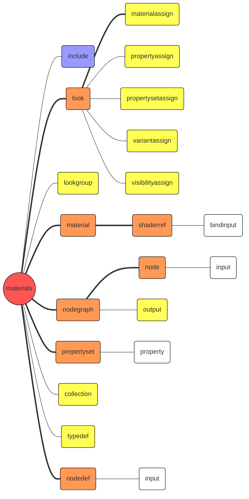

## Element

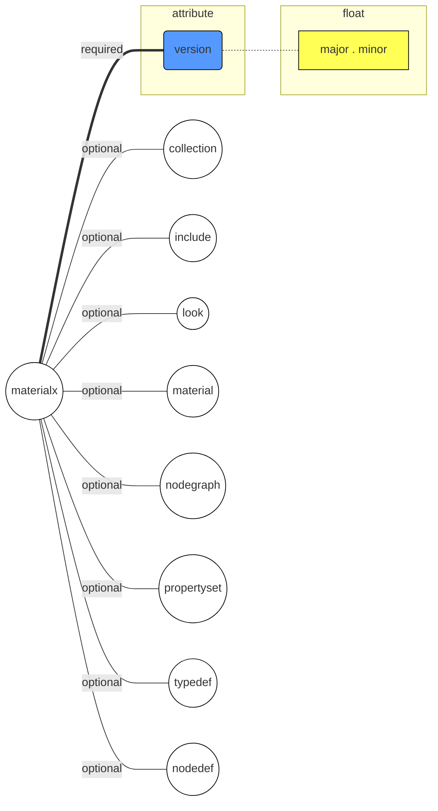

### include

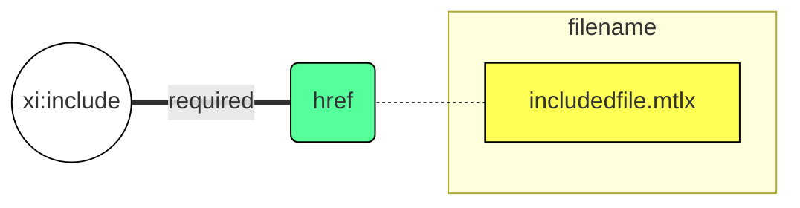

### look

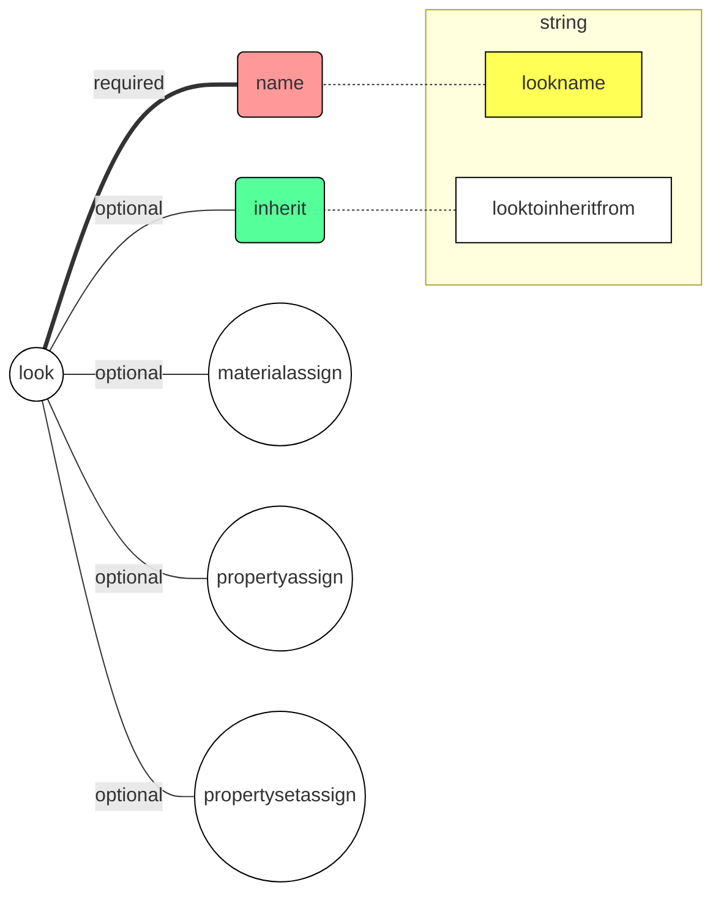

#### materialassign

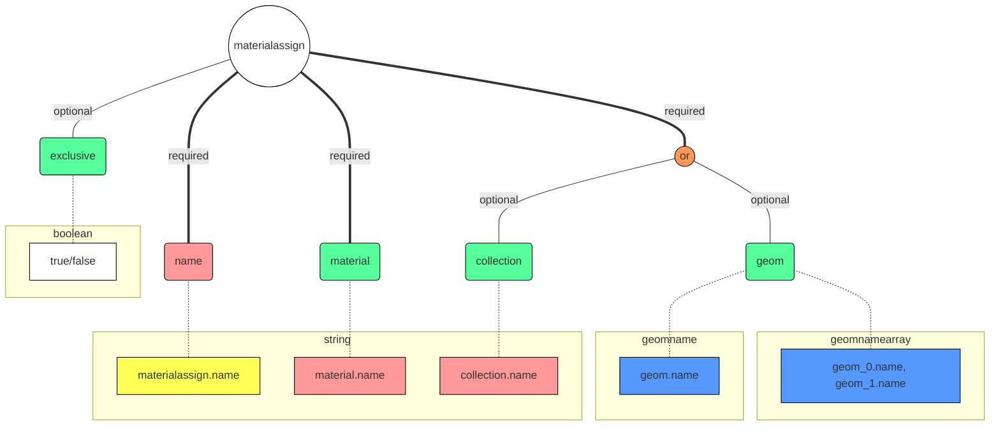

```
<materialassign name=" maname " material=" materialname "
[geom=" geomexpr1[,geomexpr2...] "] [collection=" collectionname "]
[exclusive=true|false]>
...optional variantassign elements...
</materialassign>
```

#### propertyassign

```mermaid
graph BT
classDef style_element_cur fill:#fff,stroke:#000,stroke-width:1px,fill-opacity:1
classDef style_element_1 fill:#fff,stroke:#000,stroke-width:1px,fill-opacity:1
classDef style_attribute_optional fill:#fff,stroke:#000,stroke-width:1px,fill-opacity:1
classDef style_attribute_input fill:#5f9,stroke:#000,stroke-width:1px,fill-opacity:1
classDef style_attribute_output fill:#f99,stroke:#000,stroke-width:1px,fill-opacity:1
classDef style_attribute_materialx fill:#95f,stroke:#000,stroke-width:1px,fill-opacity:1
classDef style_attribute_def fill:#59f,stroke:#000,stroke-width:1px,fill-opacity:1
classDef style_data_optional fill:#fff,stroke:#000,stroke-width:1px,fill-opacity:1
classDef style_data_output fill:#f99,stroke:#000,stroke-width:1px,fill-opacity:1
classDef style_data_custom fill:#ff5,stroke:#000,stroke-width:1px,fill-opacity:1
classDef style_data_materialx fill:#ff5,stroke:#000,stroke-width:1px,fill-opacity:1
classDef style_data_dcc fill:#59f,stroke:#000,stroke-width:1px,fill-opacity:1
classDef style_branch_0 fill:#f95,stroke:#000,stroke-width:1px,fill-opacity:1

propertyassign((propertyassign)); class propertyassign style_element_cur
propertyassign.name(name); class propertyassign.name style_attribute_output
propertyassign.type(type); class propertyassign.type style_attribute_input
propertyassign.value(value); class propertyassign.value style_attribute_input
propertyassign.property(property); class propertyassign.property style_attribute_input
propertyassign.target(target); class propertyassign.target style_attribute_input
propertyassign.geom(geom); class propertyassign.geom style_attribute_input
propertyassign.collection(collection); class propertyassign.collection style_attribute_input
propertyassign_branch_0(("or")); class propertyassign_branch_0 style_branch_0
    propertyassign.name ===|"required"| propertyassign
    propertyassign.type ===|"required"| propertyassign
    propertyassign.value ===|"required"| propertyassign
    propertyassign.property ===|"required"| propertyassign
    propertyassign.target ---|"optional"| propertyassign
    propertyassign_branch_0 ===|"required"| propertyassign
    propertyassign.geom ---|"optional"| propertyassign_branch_0
    propertyassign.collection ---|"optional"| propertyassign_branch_0

subgraph string
    node.namestring["propertyassign.name"]; class node.namestring style_data_custom
end
    node.namestring -.- propertyassign.name

subgraph geomname
    data0.value.geomname["geom.name"]; class data0.value.geomname style_data_dcc
end
    data0.value.geomname -.- propertyassign.geom
subgraph geomnamearray
    data0.value.geomnamearray["geom_0.name, geom_1.name"]; class data0.value.geomnamearray style_data_dcc
end
    data0.value.geomnamearray -.- propertyassign.geom
subgraph string
    data1.value.string["collection.name"]; class data1.value.string style_data_output
end
    data1.value.string -.- propertyassign.collection
subgraph string
    data2.value.string["targetname"]; class data2.value.string style_data_optional
end
    data2.value.string -.- propertyassign.target

subgraph string
    data.type.string["data.type"]; class data.type.string style_data_materialx
end
    data.type.string -.- propertyassign.type
subgraph data.value
    data.value.rawdata["data.value"]; class data.value.rawdata style_data_materialx
end
    data.value.rawdata -.- propertyassign.value
subgraph string
    geom.property.name["geom.attribute.name"]; class geom.property.name style_data_dcc
end
    geom.property.name -.- propertyassign.property
```

#### propertysetassign

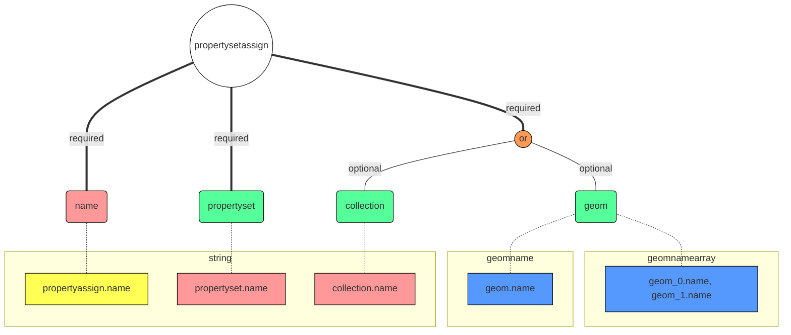

#### <u>variantassign</u>

#### <u>visibilityassign</u>

### <u>lookgroup</u>

### material

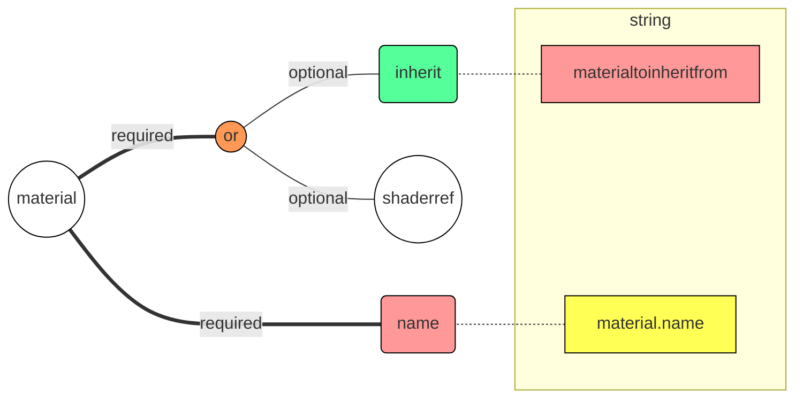

#### shaderref

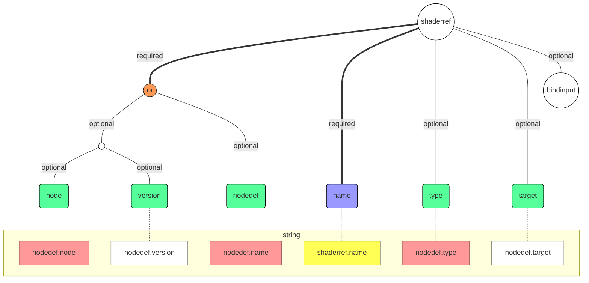

##### bindinput

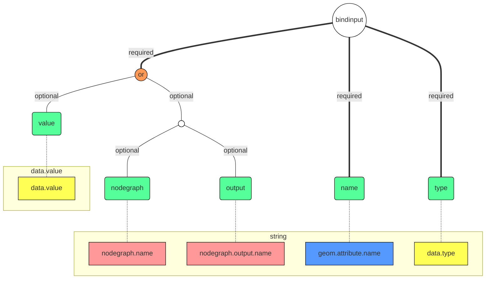


```
<material name="steel">
    <shaderref name="sref4" node="simplesrf">
        <bindinput name="diffColor" type="color3" nodegraph="DiffNoise output="o_diffColor"/>
        <bindinput name="specColor" type="color3" output="o_specColor"/>
        <bindinput name="roughness" type="float" value="0.02"/>
    </shaderref>
</material>
```

### nodegraph

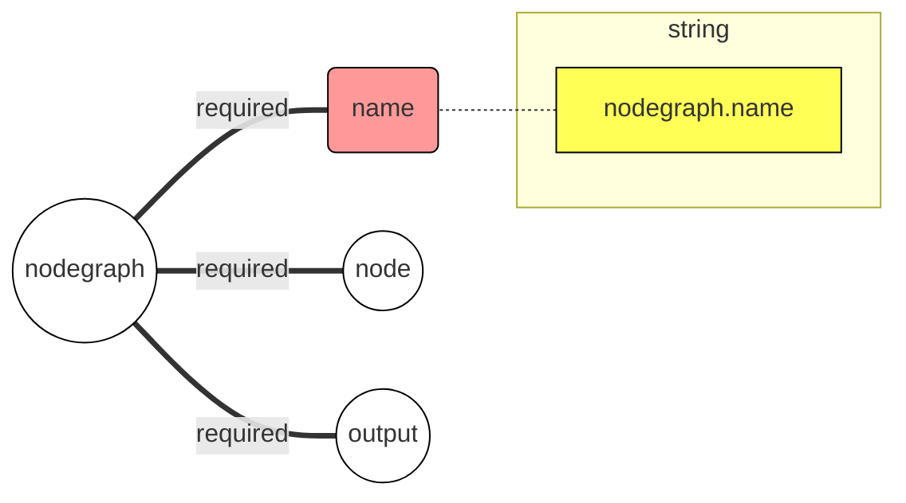

```
<nodegraph name=" graphname ">
...node element(s)...
...output element(s)...
</nodegraph>
```

#### node

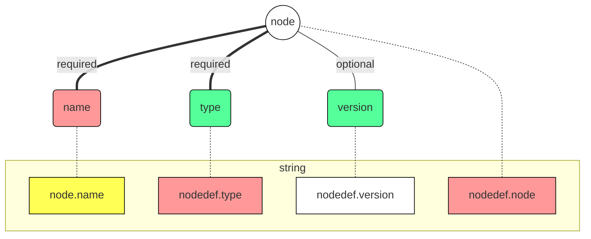

```
< nodecategory name=" nodename " type=" outputdatatype " [version=" version "]>
	<input name=" paramname " type=" type " [nodename=" nodename "] [value=" value "]/>
	<parameter name=" paramname " type=" type " value=" value "/>
	...additional input or parameter elements...
</ nodecategory >
```

##### input

```mermaid
graph BT
classDef style_element_cur fill:#fff,stroke:#000,stroke-width:1px,fill-opacity:1
classDef style_element_1 fill:#fff,stroke:#000,stroke-width:1px,fill-opacity:1
classDef style_attribute_input fill:#5f9,stroke:#000,stroke-width:1px,fill-opacity:1
classDef style_attribute_output fill:#f99,stroke:#000,stroke-width:1px,fill-opacity:1
classDef style_attribute_materialx fill:#95f,stroke:#000,stroke-width:1px,fill-opacity:1
classDef style_attribute_def fill:#59f,stroke:#000,stroke-width:1px,fill-opacity:1
classDef style_data_output fill:#f99,stroke:#000,stroke-width:1px,fill-opacity:1
classDef style_data_custom fill:#ff5,stroke:#000,stroke-width:1px,fill-opacity:1
classDef style_data_materialx fill:#ff5,stroke:#000,stroke-width:1px,fill-opacity:1
classDef style_data_dcc fill:#59f,stroke:#000,stroke-width:1px,fill-opacity:1
classDef style_branch_0 fill:#f95,stroke:#000,stroke-width:1px,fill-opacity:1
classDef style_branch_bound fill:#fff,stroke:#000,stroke-width:1px,fill-opacity:1

input((input)); class input style_element_cur

input_branch(("or")); class input_branch style_branch_0
input_bound((" ")); class input_bound style_branch_bound
input.name(name); class input.name style_attribute_input
input.type(type); class input.type style_attribute_input
input.value(value); class input.value style_attribute_input
input.nodename(nodename); class input.nodename style_attribute_input
input.member(member); class input.member style_attribute_input
input.channels(channels); class input.channels style_attribute_input

input_branch ===|"required"| input
input.name ===|"required"| input
input.type ===|"required"| input
input.value ---|"optional"| input_branch
input_bound ---|"optional"| input_branch
input.nodename ---|"optional"| input_bound
input.member ---|"optional"| input_bound
input.channels ---|"optional"| input_bound

subgraph string
    data.value.string["node.name"]; class data.value.string style_data_output
end
    data.value.string -.- input.nodename

subgraph string
    nodedef.input.name["nodedef.input.name"]; class nodedef.input.name style_data_output
end
    nodedef.input.name -.- input.name
subgraph string
    nodedef.input.type["nodedef.input.type"]; class nodedef.input.type style_data_output
end
    nodedef.input.type -.- input.type
subgraph data.value
    data.value["data.value"]; class data.value style_data_materialx
end
    data.value -.- input.value

subgraph string
    data0.value.string["channel.name"]; class data0.value.string style_data_output
end
    data0.value.string -.- input.channels
```
```
<input name=" paramname " type=" type " [nodename=" nodename " member=" membername " channels=" channels "] [value=" value "]/>
```

#### output

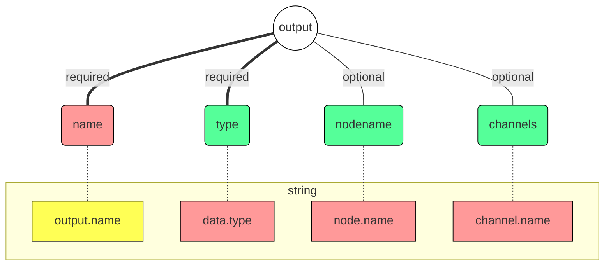

### propertyset

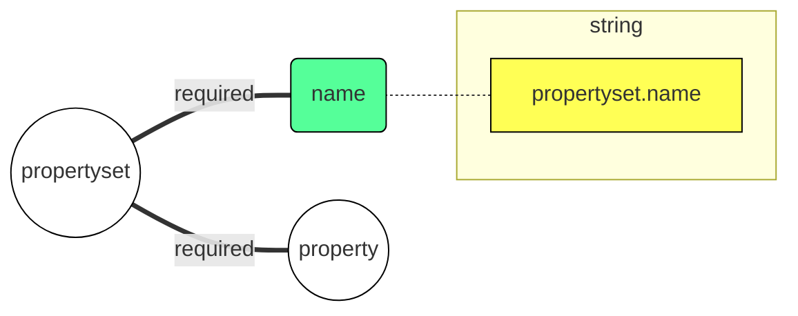

#### property

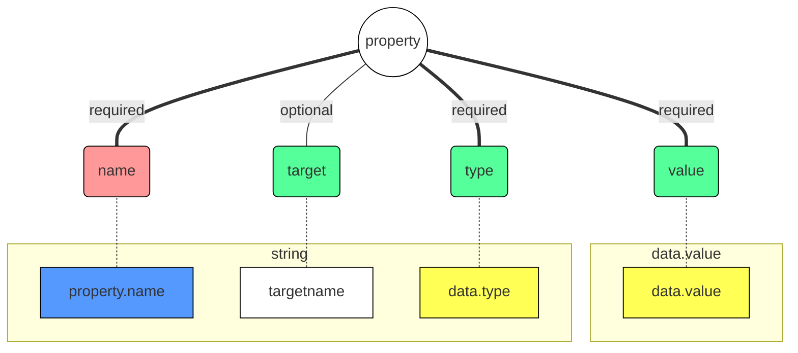

### collection

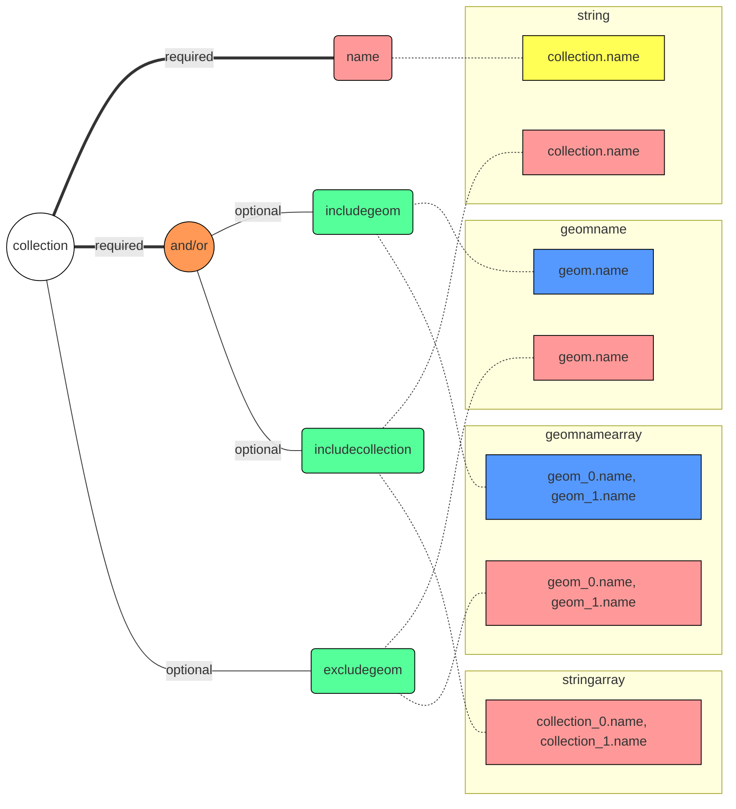

```
<collection name=" collectionname " [includegeom="geomexpr1[,geomexpr2]..."]
[includecollection="collectionname1[,collectionname2]..."]
[excludegeom="geomexpr3[,geomexpr4]..."]/>
```

### typedef

### nodedef

## Data

### type

#### base

-   integer

-   boolean

-   float

-   color2

-   color3

-   color4

-   vector2

-   vector3

-   vector4

-   matrix33

-   matrix44

-   string

-   filename

-   geomname

#### array

-   integerarray

-   floatarray

-   color2array

-   color3array

-   color4array

-   vector2array

-   vector3array

-   vector4array

-   stringarray

-   geomnamearray

### value

## Property

## Flow

### read

-   look --> material --> nodegraph

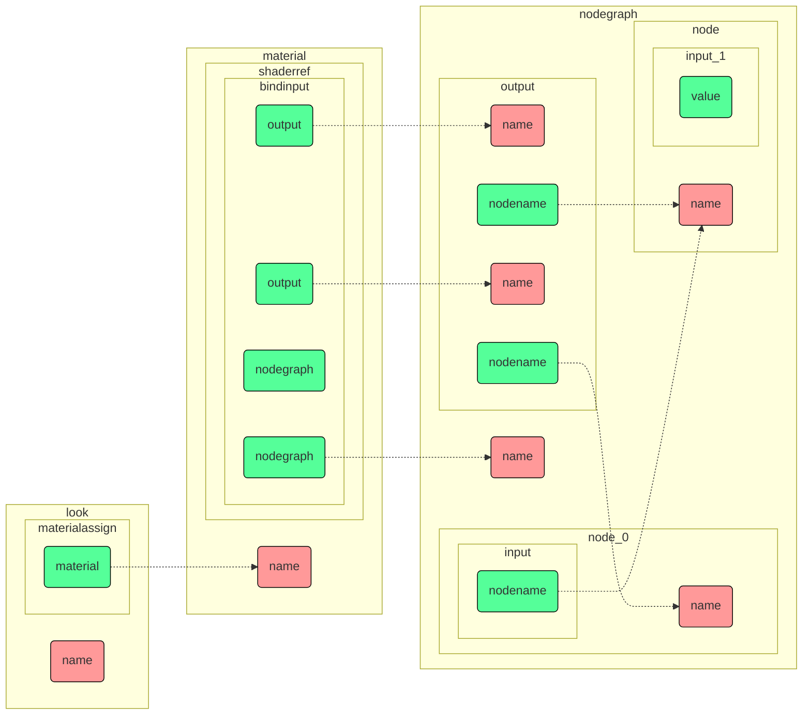
